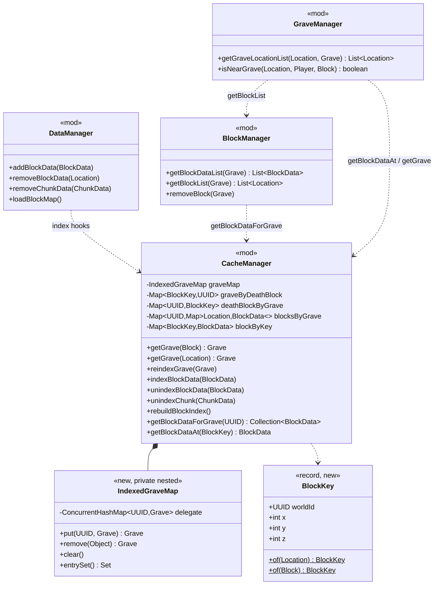
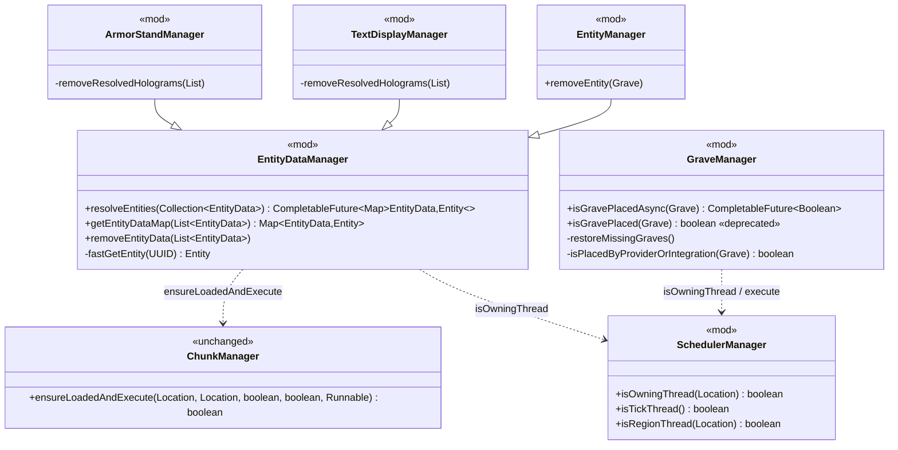
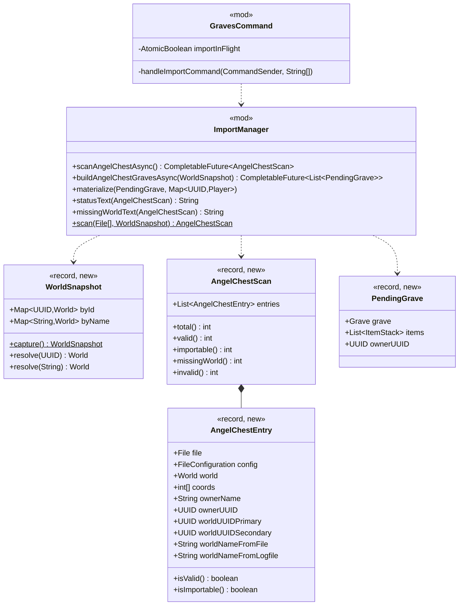

# Phase 1 LLD: Main-Thread Stall Remediation

> **Audit Reference:** No HLD exists for this work. The motivating evidence is recorded inline in
> [Background: Audit Findings](#background-audit-findings) so this document stands alone.
> **Status:** Proposed
> **Last Updated:** 2026-09-21

---

## Table of Contents

- [Scope](#scope)
- [Background: Audit Findings](#background-audit-findings)
- [Class Diagrams](#class-diagrams)
- [1. WP1 — Grave & Block Location Index](#1-wp1--grave--block-location-index)
- [2. WP2 — Future-Based Entity Resolution & Placement Checks](#2-wp2--future-based-entity-resolution--placement-checks)
- [3. WP3 — Asynchronous AngelChest Import](#3-wp3--asynchronous-angelchest-import)
- [4. WP4 — Lazy Debug Messages](#4-wp4--lazy-debug-messages)
- [5. Deletions](#5-deletions)
- [6. Key Flows](#6-key-flows)
- [7. Implementation Order](#7-implementation-order)
- [8. Unit Tests](#8-unit-tests)
- [9. Resolved Design Decisions](#9-resolved-design-decisions)
- [10. Open Items / Future Considerations](#10-open-items--future-considerations)
- [File Changes Summary](#file-changes-summary)

---

## Scope

This phase removes the four main-thread cost centres identified by the September 2026 performance audit. Each work package is independent, lands as its own reviewable batch, and is behaviour-preserving unless a design decision below says otherwise.

| Work Package | Problem | Fix Shape | Batch Size |
|---|---|---|---|
| **WP1** | `isNearGrave` is O(graves × chunks); `CacheManager.getGrave(Block/Location)` is O(graves). Both are wired into the highest-frequency block events in the game. | Two O(1) indexes in `CacheManager` (death-location → grave, grave → placed blocks), maintained at the existing cache write choke points. | ~7 classes |
| **WP2** | `EntityDataManager` blocks the main thread on a `CountDownLatch` waiting for a task it has queued *behind itself*; `GraveManager.isGravePlaced` does the same with `Future.get(100ms)`. Every wait burns its full timeout and returns a null result. | Replace the blocking waits with `CompletableFuture` pipelines; run inline when already on the owning thread. | ~8 classes |
| **WP3** | `/graves import angelchest` calls `callSyncMethod(...).get()` with no timeout from the main thread — a permanent server hang — and re-parses every AngelChest YAML file three times. | Move file I/O and parsing to an async task; snapshot worlds on the main thread first; materialise graves back on the owning thread in bounded per-tick batches. | ~4 classes + 4 new types |
| **WP4** | 337 `debugMessage("..." + x)` call sites eagerly build strings that are discarded because debug is off; `DebugManager.isEnabled` re-reads the YAML config path on every call. | `Supplier<String>` overload, cached debug level, and a sweep of the tick/event hot paths. | ~12 classes |

**In scope:**

- `BlockKey` value type and the two `CacheManager` indexes (WP1)
- Index maintenance at `DataManager` block/chunk mutators and the `graveMap` view (WP1)
- Rewrites of `BlockManager.getBlockList / getBlockDataList / removeBlock(Grave)` and `GraveManager.getGraveLocationList / isNearGrave` on top of the indexes (WP1)
- `EntityDataManager.resolveEntities` future pipeline; non-blocking `getEntityDataMap` and `removeEntityData` (WP2)
- `GraveManager.isGravePlacedAsync` and a future-driven `restoreMissingGraves` (WP2)
- `SchedulerManager.isOwningThread(Location)` helper (WP2)
- Async AngelChest scan/import pipeline and command wiring (WP3)
- `DebugManager` level cache + `Supplier` overloads, and conversion of hot-path call sites (WP4)
- Minimal JUnit 5 + Mockito test infrastructure (first tests in this repository)

**Out of scope (tracked in [Open Items](#10-open-items--future-considerations)):**

- `StringUtil.parseString` per-line cost (uncached `SimpleDateFormat`, `Pattern.compile`, unconditional PlaceholderAPI pass)
- `ConfigManager.getConfigSection` memoisation
- The `return`-instead-of-`continue` bug in `GraveManager.processChunks` (deliberately left; see Open Item 1)
- `EntityDataManager.getLoadedEntityDataList` O(chunks) scan
- Converting integration `removeFurniture` paths to the async resolver
- `SafeLocationManager` fluid-column O(depth²) rescan
- The remaining (non-hot-path) debug string conversions

---

## Background: Audit Findings

Three independent audits (database/IO, thread synchronisation, algorithmic cost) were run against commit `ad6888b`. Every finding below was re-verified by reading the code. Line numbers refer to that commit.

### F1 — Self-deadlock-until-timeout in `EntityDataManager` (CRITICAL, no config gate)

`EntityDataManager.java:225`, `:309`, `:380` call `latch.await(25L, MILLISECONDS)` on the calling thread. The latch is only counted down inside a task handed to `ChunkManager.ensureLoadedAndExecute`, which for an already-loaded chunk (`ChunkManager.java:146-149`) dispatches via `execute(anchor, task)` → `SchedulerManager.runTask(task)` (`ChunkManager.java:189`). `SchedulerManager.runTask` is a pass-through to the shaded `GlobalScheduler`, whose Bukkit implementation is `Bukkit.getScheduler().runTask(plugin, r)` — an unconditional next-tick dispatch with no primary-thread fast path. When the caller *is* the main thread, the task cannot run until the caller returns; the wait burns the full 25 ms, `ref.get()` is `null`, and the entity is silently dropped from the result map.

Reached from: the sync 1-second timer (`GraveManager.java:76` → `removeExpiredElements` → `removeEntityData` → `HologramManager.removeHologram` → `ArmorStandManager.java:220`), `BlockBreakListener.java:112`, `InventoryCloseListener.java:117`, and `/graves purge`. Traversed three times per grave removal (ArmorStand holograms, TextDisplay holograms, `EntityManager.removeEntity`). Cost: 25 ms × unresolved entities × 3 per removal; a mass-expiry tick stalls for seconds.

Additional observation: `Bukkit.getEntity(UUID)` (the `fastGetEntity` path) is available on every server this plugin supports (`api-version: 1.13`). It finds every loaded entity. The chunk scan therefore only ever adds value when the chunk is **unloaded** — the exact case the latch path is guaranteed to lose.

### F2 — Same pattern in `GraveManager.isGravePlaced` (CRITICAL when enabled)

`GraveManager.java:1512-1540`: schedules the world check via `execute(location, ...)` (next tick) then `result.get(100, MILLISECONDS)` on the main thread. Always times out from the main thread. The timeout branch returns `true` **without** adding to `knownGraves`, so the 100 ms is re-paid for the same grave every pass. Looped over every cached grave by `restoreMissingGraves` (`:1397`). Gated by `grave.check-missing-graves` (default `false`, `grave.yml:29`).

### F3 — O(G × C) `isNearGrave` on block events (CRITICAL)

`GraveManager.isNearGrave` (`:2573`) iterates every cached grave and, per grave, calls `getGraveLocation` (`:2409`) → `getGraveLocationList` (`:2371`) → `BlockManager.getBlockList` (`:193`), which walks the **entire** chunk map and allocates one `ArrayList` per chunk to find the one or two blocks belonging to that grave. At 1,000 graves that is ~10⁶ iterations and ~10⁶ allocations per call. Call sites: `EntityChangeListener:36`, `BlockBurnAndIgniteListener:33,45-46,59-60`, `BlockPlaceListener:39`, `BlockBreakListener:57`, `PlayerTeleportListener:53`, `PlayerBucketListener:41,59`.

`CacheManager.getGrave(Block)` (`:268`) and `getGrave(Location)` (`:319`) are linear scans over the grave map comparing block coordinates of `grave.getLocationDeath()` (which itself allocates a fresh `Location` per call via `LocationData.getLocation()`). Called from `BlockFromToListener:43` on **every fluid-flow update** at `MONITOR`, plus `ProjectileHitListener:36`, `BlockBreakListener:44`, `BlockPlaceListener:35`, `BlockPistonExtendListener:47`, `PlayerInteractListener:114,119`.

### F4 — Untimed `callSyncMethod(...).get()` on the command thread (server hang)

`ImportManager.java:279`, `:459`, `:469`, `:478` and `:380` call `callSyncMethod(...).get()` with no timeout. `GravesCommand` contains no async dispatch; `handleImportCommand` (`:1059`) runs on the main thread and calls `countAngelChestStatusText()` (`:1085`) on the **dry run**, before `confirm`. `countAngelChestStatusText` → `resolveWorldForScan` (`:128` → `:454`) → `.get()`. The scheduled callable can never run; the server hangs permanently. The dry run also parses every AngelChest YAML file three times (`countAngelChestStatusText`, `listAngelChestMissingWorldText`, `countAngelChestImportableOnly`).

### F5 — Eager debug string construction (MEDIUM, sustained)

468 `debugMessage(...)` call sites, 337 of which concatenate a string argument that is built before the level check. `DebugManager.isEnabled` (`:79-95`) reads `plugin.getConfig().getInt("settings.debug.level", 0)` per call — a `ConfigManager.config()` read-lock plus a dotted YAML path walk. Hot examples: `GraveManager.java:124-127` (per grave, per second, including `formatMillis`), `PermissionManager.java:43-54` (three concatenations per permission check at severity 4 — a level that **never prints** — on the `PlayerMoveEvent` path), `ArmorStandManager` / `TextDisplayManager` removal paths.

### Cleared

The database layer is not a contributor: every runtime write goes through `DataManager.runAsyncDatabaseTask` (`:78-98`) to a real async thread, config reads are in-memory, and no JDBC or disk I/O occurs in any listener. No 1-tick timers exist. No lock convoys exist (all `synchronized` blocks guard single `List.add` calls on locals).

---

## Class Diagrams

### Legend

- Solid arrows: composition / ownership
- Dashed arrows: calls
- `«new»`: introduced by this LLD
- `«mod»`: existing class modified by this LLD

### Diagram 1: WP1 — Location Indexes



### Diagram 2: WP2 — Entity Resolution & Placement Checks



### Diagram 3: WP3 — Async Import Pipeline



---

## 1. WP1 — Grave & Block Location Index

### 1.1 New: `dev.cwhead.GravesX.util.BlockKey`

An immutable block-coordinate key. World identity is by `World.getUID()` so keys survive world unload/reload and never hold a `World` reference. Coordinates use floor semantics (`getBlockX/Y/Z`), matching the comparisons `CacheManager.getGrave(Block)` and `GraveManager.isNearGrave` perform today.

```java
package dev.cwhead.GravesX.util;

import org.bukkit.Location;
import org.bukkit.block.Block;
import org.jetbrains.annotations.Nullable;

import java.util.UUID;

/**
 * Immutable block-coordinate key: world UID plus floored block coordinates.
 * <p>
 * Used by {@code CacheManager} to index graves and grave blocks by position without
 * holding {@link org.bukkit.World} references or relying on {@link Location#equals(Object)}
 * (which also compares yaw and pitch).
 */
public record BlockKey(UUID worldId, int x, int y, int z) {

    /**
     * Builds a key for the block containing {@code location}.
     *
     * @param location the location; may be {@code null} or have a {@code null} world
     * @return the key, or {@code null} if the location or its world is {@code null}
     */
    public static @Nullable BlockKey of(@Nullable Location location) {
        if (location == null || location.getWorld() == null) {
            return null;
        }
        return new BlockKey(location.getWorld().getUID(),
                location.getBlockX(), location.getBlockY(), location.getBlockZ());
    }

    /**
     * Builds a key for {@code block}.
     *
     * @param block the block; may be {@code null}
     * @return the key, or {@code null} if the block is {@code null}
     */
    public static @Nullable BlockKey of(@Nullable Block block) {
        if (block == null) {
            return null;
        }
        return new BlockKey(block.getWorld().getUID(), block.getX(), block.getY(), block.getZ());
    }
}
```

### 1.2 `CacheManager` — Indexes and the `IndexedGraveMap` view

**File:** `src/main/java/com/ranull/graves/manager/CacheManager.java`

#### New fields

```java
/** Death-location block → grave UUID. Populated by the graveMap view; validated on read. */
private final Map<BlockKey, UUID> graveByDeathBlock = new ConcurrentHashMap<>();

/** Reverse of graveByDeathBlock so a grave can be unindexed without recomputing its old key. */
private final Map<UUID, BlockKey> deathBlockByGrave = new ConcurrentHashMap<>();

/** Grave UUID → its placed block data, keyed by the same Location instances ChunkData uses. */
private final Map<UUID, Map<Location, BlockData>> blocksByGrave = new ConcurrentHashMap<>();

/** Block position → block data, for O(1) "is there a grave block here" checks. */
private final Map<BlockKey, BlockData> blockByKey = new ConcurrentHashMap<>();
```

`graveMap` changes from `new HashMap<>()` to `new IndexedGraveMap()` (below). Its declared type stays `Map<UUID, Grave>` and `getGraveMap()` is unchanged, so **no writer or reader of the grave map needs to change** (D2).

#### New private nested class: `IndexedGraveMap`

A `Map<UUID, Grave>` view whose mutators maintain `graveByDeathBlock` / `deathBlockByGrave`. All `java.util.Map` default methods (`putIfAbsent`, `compute*`, `merge`, `replace`, `remove(k, v)`) are implemented in terms of `get`/`put`/`remove`, so overriding those three plus `clear`, `putAll` and the `entrySet` iterator's `remove` covers every mutation path.

```java
private final class IndexedGraveMap extends AbstractMap<UUID, Grave> {
    private final ConcurrentHashMap<UUID, Grave> delegate = new ConcurrentHashMap<>();

    @Override public Grave get(Object key) { return delegate.get(key); }
    @Override public boolean containsKey(Object key) { return delegate.containsKey(key); }
    @Override public int size() { return delegate.size(); }

    @Override
    public Grave put(UUID key, Grave value) {
        Grave previous = delegate.put(key, value);
        if (previous != null) unindexDeath(key);
        indexDeath(value);
        return previous;
    }

    @Override
    public Grave remove(Object key) {
        Grave removed = delegate.remove(key);
        if (removed != null && key instanceof UUID uuid) {
            unindexDeath(uuid);
            blocksByGrave.remove(uuid); // block index entries for a gone grave are dead weight
        }
        return removed;
    }

    @Override
    public void putAll(Map<? extends UUID, ? extends Grave> m) {
        m.forEach(this::put);
    }

    @Override
    public void clear() {
        delegate.clear();
        graveByDeathBlock.clear();
        deathBlockByGrave.clear();
    }

    @Override
    public Set<Entry<UUID, Grave>> entrySet() {
        return new AbstractSet<>() {
            @Override public int size() { return delegate.size(); }

            @Override
            public Iterator<Entry<UUID, Grave>> iterator() {
                Iterator<Entry<UUID, Grave>> it = delegate.entrySet().iterator();
                return new Iterator<>() {
                    private Entry<UUID, Grave> current;
                    @Override public boolean hasNext() { return it.hasNext(); }
                    @Override public Entry<UUID, Grave> next() { return current = it.next(); }
                    @Override
                    public void remove() {
                        it.remove();
                        if (current != null) {
                            unindexDeath(current.getKey());
                            blocksByGrave.remove(current.getKey());
                        }
                    }
                };
            }
        };
    }
}
```

Note: `blocksByGrave` is *not* cleared in `clear()`. `loadGraveMap()` clears the grave map before `loadBlockMap()` runs, and block index entries are keyed by grave UUID that will be re-put; stale entries are harmless and are dropped by `rebuildBlockIndex()` at the end of `loadBlockMap()` (§1.3).

#### New private helpers

```java
private void indexDeath(Grave grave) {
    if (grave == null || grave.getUUID() == null) return;
    BlockKey key = BlockKey.of(grave.getLocationDeath());
    if (key == null) return;
    deathBlockByGrave.put(grave.getUUID(), key);
    graveByDeathBlock.put(key, grave.getUUID());
}

private void unindexDeath(UUID graveUUID) {
    BlockKey old = deathBlockByGrave.remove(graveUUID);
    if (old != null) graveByDeathBlock.remove(old, graveUUID);
}

private @Nullable Grave getGraveAtDeathBlock(@Nullable BlockKey key) {
    if (key == null) return null;
    UUID uuid = graveByDeathBlock.get(key);
    if (uuid == null) return null;

    Grave grave = graveMap.get(uuid);
    if (grave == null || !key.equals(BlockKey.of(grave.getLocationDeath()))) {
        // Self-heal: the grave was removed or its death location changed without reindexGrave().
        graveByDeathBlock.remove(key, uuid);
        return null;
    }
    return grave;
}
```

#### Modified public methods

**Before:**

```java
public Grave getGrave(Block block) {
    for (Grave grave : graveMap.values()) {
        if (grave == null) continue;
        Location graveLocation = grave.getLocationDeath();
        if (graveLocation == null || graveLocation.getWorld() == null) continue;
        if (graveLocation.getWorld().equals(block.getWorld()) && graveLocation.getBlockX() == block.getX()
                && graveLocation.getBlockY() == block.getY() && graveLocation.getBlockZ() == block.getZ()) {
            return grave;
        }
    }
    return null;
}

public Grave getGrave(Location location) {
    /* identical linear scan keyed on location.getBlockX/Y/Z */
}
```

**After:**

```java
public Grave getGrave(Block block) {
    return getGraveAtDeathBlock(BlockKey.of(block));
}

public Grave getGrave(Location location) {
    return getGraveAtDeathBlock(BlockKey.of(location));
}
```

#### New public methods

```java
/**
 * Re-indexes a cached grave after its death location changed. Must be called by any code
 * that invokes {@link Grave#setLocationDeath(Location)} on a grave that is already in the cache.
 */
public void reindexGrave(Grave grave) {
    if (grave == null || grave.getUUID() == null) return;
    unindexDeath(grave.getUUID());
    if (graveMap.containsKey(grave.getUUID())) indexDeath(grave);
}

/** Records a placed grave block. Idempotent. */
public void indexBlockData(BlockData blockData) {
    if (blockData == null || blockData.getGraveUUID() == null || blockData.getLocation() == null) return;
    BlockKey key = BlockKey.of(blockData.getLocation());
    if (key == null) return;
    blocksByGrave.computeIfAbsent(blockData.getGraveUUID(), k -> new ConcurrentHashMap<>())
            .put(blockData.getLocation(), blockData);
    blockByKey.put(key, blockData);
}

/** Forgets a placed grave block. No-op if unknown. */
public void unindexBlockData(BlockData blockData) {
    if (blockData == null || blockData.getLocation() == null) return;
    BlockKey key = BlockKey.of(blockData.getLocation());
    if (key != null) blockByKey.remove(key, blockData);
    if (blockData.getGraveUUID() != null) {
        Map<Location, BlockData> perGrave = blocksByGrave.get(blockData.getGraveUUID());
        if (perGrave != null) {
            perGrave.remove(blockData.getLocation(), blockData);
            if (perGrave.isEmpty()) blocksByGrave.remove(blockData.getGraveUUID(), perGrave);
        }
    }
}

/** Forgets every block of a chunk being dropped from the cache. */
public void unindexChunk(ChunkData chunkData) {
    if (chunkData == null) return;
    for (BlockData blockData : new ArrayList<>(chunkData.getBlockDataMap().values())) {
        unindexBlockData(blockData);
    }
}

/** Rebuilds both block indexes from the chunk map. O(chunks + blocks); called once after load. */
public void rebuildBlockIndex() {
    blocksByGrave.clear();
    blockByKey.clear();
    for (ChunkData chunkData : chunkMap.values()) {
        for (BlockData blockData : chunkData.getBlockDataMap().values()) {
            indexBlockData(blockData);
        }
    }
}

/**
 * Placed block data for a grave. Returns a live, thread-safe view; callers that mutate the
 * cache while iterating must copy first.
 */
public Collection<BlockData> getBlockDataForGrave(UUID graveUUID) {
    Map<Location, BlockData> perGrave = graveUUID != null ? blocksByGrave.get(graveUUID) : null;
    return perGrave != null ? Collections.unmodifiableCollection(perGrave.values()) : List.of();
}

/** Block data at a position, or {@code null} if no grave block is recorded there. */
public @Nullable BlockData getBlockDataAt(@Nullable BlockKey key) {
    return key != null ? blockByKey.get(key) : null;
}
```

### 1.3 `DataManager` — Index maintenance at the block/chunk choke points

**File:** `src/main/java/com/ranull/graves/manager/DataManager.java`

`ChunkData.addBlockData` / `removeBlockData` are called from exactly three places in the codebase, all in `DataManager` (`:1680`, `:1985/1987`, `:2027`); `removeChunkData` (`:899`) drops whole chunks. `MultiPaper.java:147` routes through `DataManager.addBlockData`. These four sites are therefore the complete set of index hooks (D3).

#### `addBlockData(BlockData)` — `:1979`

**Before:**

```java
if (loc != null && loc.getWorld() != null && plugin.getVersionManager().isFolia()) {
    plugin.getSchedulerManager().execute(loc, () -> getChunkData(loc).addBlockData(blockData));
} else {
    Objects.requireNonNull(getChunkData(loc)).addBlockData(blockData);
}
```

**After:**

```java
if (loc != null && loc.getWorld() != null && plugin.getVersionManager().isFolia()) {
    plugin.getSchedulerManager().execute(loc, () -> {
        getChunkData(loc).addBlockData(blockData);
        plugin.getCacheManager().indexBlockData(blockData);
    });
} else {
    Objects.requireNonNull(getChunkData(loc)).addBlockData(blockData);
    plugin.getCacheManager().indexBlockData(blockData);
}
```

#### `removeBlockData(Location)` — `:2019`

**Before:**

```java
plugin.getSchedulerManager().execute(location, () -> {
    ChunkData chunkData = getChunkData(location);
    if (chunkData != null) {
        chunkData.removeBlockData(location);
    }
});
```

**After:**

```java
plugin.getSchedulerManager().execute(location, () -> {
    ChunkData chunkData = getChunkData(location);
    if (chunkData != null) {
        BlockData removed = chunkData.getBlockDataMap().get(location);
        chunkData.removeBlockData(location);
        if (removed != null) plugin.getCacheManager().unindexBlockData(removed);
    }
});
```

#### `removeChunkData(ChunkData)` — `:899`

Add `plugin.getCacheManager().unindexChunk(chunkData);` as the first statement after the null checks, before either `chunkMap.remove(key)` branch.

#### `loadBlockMap()` — `:1620`

The per-chunk apply lambda at `:1680` (`getChunkData(w.loc).addBlockData(w.data)`) gains `plugin.getCacheManager().indexBlockData(w.data);` on the following line. After all groups have been scheduled, schedule one final `plugin.getSchedulerManager().runTask(() -> plugin.getCacheManager().rebuildBlockIndex())` so the index is consistent even if a per-chunk apply was skipped or a stale entry survived a reload (D4).

### 1.4 `BlockManager` — Index-backed grave → block lookups

**File:** `src/main/java/com/ranull/graves/manager/BlockManager.java`

**Before** (`:173-205`, both methods share the shape):

```java
public List<Location> getBlockList(Grave grave) {
    List<Location> locationList = new ArrayList<>();
    for (Map.Entry<String, ChunkData> chunkDataEntry : plugin.getCacheManager().getChunkMap().entrySet()) {
        for (BlockData blockData : new ArrayList<>(chunkDataEntry.getValue().getBlockDataMap().values())) {
            if (grave.getUUID().equals(blockData.getGraveUUID())) {
                locationList.add(blockData.getLocation());
            }
        }
    }
    return locationList;
}
```

**After:**

```java
public List<BlockData> getBlockDataList(Grave grave) {
    if (grave == null || grave.getUUID() == null) return new ArrayList<>();
    return new ArrayList<>(plugin.getCacheManager().getBlockDataForGrave(grave.getUUID()));
}

public List<Location> getBlockList(Grave grave) {
    List<Location> locationList = new ArrayList<>();
    for (BlockData blockData : getBlockDataList(grave)) {
        locationList.add(blockData.getLocation());
    }
    return locationList;
}
```

**`removeBlock(Grave)`** (`:212`) — **Before** iterates the whole chunk map and only removes blocks whose chunk is loaded. **After** preserves the loaded-chunk filter without the scan:

```java
public void removeBlock(Grave grave) {
    for (BlockData blockData : getBlockDataList(grave)) {
        Location location = blockData.getLocation();
        World world = location != null ? location.getWorld() : null;
        if (world != null && world.isChunkLoaded(location.getBlockX() >> 4, location.getBlockZ() >> 4)) {
            removeBlock(blockData);
        }
    }
}
```

The returned `Location` instances are the same objects stored in `ChunkData.blockDataMap`, exactly as today (D5).

### 1.5 `GraveManager` — `getGraveLocationList` and `isNearGrave`

**File:** `src/main/java/com/ranull/graves/manager/GraveManager.java`

#### `getGraveLocationList(Location, Grave)` — `:2371`

**Before:** copies `getBlockList`, appends the death location if absent, then buckets by `distanceSquared` into a `HashMap<Double, Location>` and copies through a `TreeMap` — which silently **drops** any two locations at identical distance.

**After:**

```java
public List<Location> getGraveLocationList(Location baseLocation, Grave grave) {
    if (baseLocation == null || grave == null) return new ArrayList<>();

    List<Location> locationList = plugin.getBlockManager().getBlockList(grave);
    Location death = grave.getLocationDeath();
    if (death != null && !locationList.contains(death)) locationList.add(death);

    World baseWorld = baseLocation.getWorld();
    if (baseWorld == null) return locationList;

    List<Location> sameWorld = new ArrayList<>(locationList.size());
    List<Location> otherWorld = new ArrayList<>();
    for (Location location : locationList) {
        if (location == null) continue;
        (baseWorld.equals(location.getWorld()) ? sameWorld : otherWorld).add(location);
    }
    sameWorld.sort(Comparator.comparingDouble(baseLocation::distanceSquared)); // stable; ties kept (D6)
    sameWorld.addAll(otherWorld);
    return sameWorld;
}
```

#### `isNearGrave(Location, Player, Block)` — `:2573`

The current predicate is: *there exists a grave whose nearest location (to `base`, among its placed blocks ∪ death location) has the same block coordinates as `location`*. A grave can only satisfy this if `location`'s block **is** one of its placed blocks or its death block. Both are O(1) index lookups, so at most two candidate graves need the nearest-location check — an exact reformulation, not a semantic change (D7).

**After:**

```java
public boolean isNearGrave(Location location, Player player, Block block) {
    if (location == null || location.getWorld() == null) return false;

    BlockKey key = BlockKey.of(location);
    CacheManager cache = plugin.getCacheManager();

    Set<Grave> candidates = new LinkedHashSet<>(2);
    BlockData blockData = cache.getBlockDataAt(key);
    if (blockData != null) {
        Grave byBlock = cache.getGrave(blockData.getGraveUUID());
        if (byBlock != null) candidates.add(byBlock);
    }
    Grave byDeath = cache.getGrave(location);
    if (byDeath != null) candidates.add(byDeath);

    if (candidates.isEmpty()) return false;

    Location base = (player != null) ? player.getLocation()
            : (block != null) ? block.getLocation()
            : location;

    for (Grave grave : candidates) {
        Location nearest = getGraveLocation(base, grave);
        if (nearest != null && nearest.getWorld() != null
                && nearest.getWorld().equals(location.getWorld())
                && nearest.getBlockX() == location.getBlockX()
                && nearest.getBlockY() == location.getBlockY()
                && nearest.getBlockZ() == location.getBlockZ()) {
            return true;
        }
    }
    return false;
}
```

The `catch (Throwable ignored)` wrapper in the current implementation is dropped; nothing in the new body can throw on valid input, and swallowing `Throwable` hides real bugs.

### 1.6 `GraveCreationAPI` — Death location must be set before caching

**File:** `src/main/java/dev/cwhead/GravesX/api/grave/GraveCreationAPI.java:354-355`

**Before:**

```java
cacheManager.getGraveMap().put(grave.getUUID(), grave);
grave.setLocationDeath(finalLocationDeath);
```

**After:**

```java
grave.setLocationDeath(finalLocationDeath);
cacheManager.getGraveMap().put(grave.getUUID(), grave);
```

`setLocationDeath` only assigns a field, so reordering is safe. The other three `setLocationDeath` sites (`EntityDeathListener:972`, `DataManager:2558`, `ImportManager:319`) all run before the grave is put into the cache and need no change. Any future code that changes a cached grave's death location must call `CacheManager.reindexGrave(grave)`; the self-heal in `getGraveAtDeathBlock` bounds the damage if it does not.

---

## 2. WP2 — Future-Based Entity Resolution & Placement Checks

### 2.1 `SchedulerManager.isOwningThread(Location)`

**File:** `src/main/java/dev/cwhead/GravesX/manager/SchedulerManager.java`

The shaded `GlobalScheduler`'s `isTickThread()` / `isRegionThread(Location)` exist but their non-Folia semantics are not verified. Rather than depend on them, add one helper with explicit semantics and use it at every "run inline or schedule" decision in this LLD (D8):

```java
/**
 * Whether the current thread may touch world state at {@code location} right now:
 * the region thread on Folia, the primary thread everywhere else.
 */
public boolean isOwningThread(@NotNull Location location) {
    if (plugin.getVersionManager().isFolia()) {
        return scheduler.isRegionThread(location);
    }
    return Bukkit.isPrimaryThread();
}
```

### 2.2 `EntityDataManager` — `resolveEntities` and non-blocking lookups

**File:** `src/main/java/com/ranull/graves/manager/EntityDataManager.java`

`EntityDataManager` is the superclass of 14 managers and integrations (`ArmorStandManager`, `TextDisplayManager`, `EntityManager`, `HologramManager`, `ItemStackManager`, `ItemsAdder`, `Oraxen`, `Nexo`, `CraftEngine`, `FurnitureLib`, `FurnitureEngine`, `PlayerNPC`, `FancyNPCs`, `Mannequins`). `getEntityDataMap` and `removeEntityData` keep their signatures so none of them need to change in this phase (D9).

#### New private record

```java
private record ChunkRef(UUID worldId, int x, int z) {}
```

#### New public method: `resolveEntities`

```java
/**
 * Resolves live entities for the given entity data without ever blocking the calling thread.
 * <p>
 * Loaded entities are resolved synchronously via {@code Bukkit.getEntity(UUID)}. Entities whose
 * chunk is <em>unloaded</em> are resolved after that chunk is loaded via
 * {@link ChunkManager#ensureLoadedAndExecute}; those loads are grouped so each chunk is loaded once.
 * An entity whose chunk is loaded but which {@code getEntity} cannot find no longer exists and is
 * omitted.
 * <p>
 * If every entity resolves synchronously the returned future is already complete and any
 * continuation runs inline on the caller. Otherwise the continuation runs on the server thread that
 * completed the last chunk load (the primary thread, or a region thread on Folia). Continuations must
 * therefore only <em>schedule</em> world mutations (via the region-aware execute helpers), never
 * perform them directly.
 *
 * @param entityDataList entity data to resolve; {@code null} entries are skipped
 * @return a future completing with the entity data → entity map for every entity that still exists
 */
public CompletableFuture<Map<EntityData, Entity>> resolveEntities(Collection<EntityData> entityDataList) {
    Map<EntityData, Entity> resolved = new ConcurrentHashMap<>();
    Map<ChunkRef, List<EntityData>> pendingByChunk = new HashMap<>();

    for (EntityData entityData : entityDataList) {
        if (entityData == null || entityData.getUUIDEntity() == null) continue;

        Entity found = fastGetEntity(entityData.getUUIDEntity());
        if (found != null) {
            resolved.put(entityData, found);
            continue;
        }

        Location location = entityData.getLocation();
        World world = location != null ? location.getWorld() : null;
        if (world == null) continue;

        int cx = location.getBlockX() >> 4;
        int cz = location.getBlockZ() >> 4;
        if (world.isChunkLoaded(cx, cz)) continue; // loaded and not found ⇒ gone (D10)

        pendingByChunk.computeIfAbsent(new ChunkRef(world.getUID(), cx, cz), k -> new ArrayList<>())
                .add(entityData);
    }

    if (pendingByChunk.isEmpty()) {
        return CompletableFuture.completedFuture(resolved);
    }

    List<CompletableFuture<Void>> loads = new ArrayList<>(pendingByChunk.size());
    for (Map.Entry<ChunkRef, List<EntityData>> entry : pendingByChunk.entrySet()) {
        List<EntityData> group = entry.getValue();
        Location anchor = group.get(0).getLocation();
        ChunkRef ref = entry.getKey();
        CompletableFuture<Void> done = new CompletableFuture<>();

        boolean scheduled = plugin.getChunkManager().ensureLoadedAndExecute(anchor, anchor, false, false, () -> {
            try {
                Map<UUID, Entity> byId = new HashMap<>();
                for (Entity entity : anchor.getWorld().getChunkAt(ref.x(), ref.z()).getEntities()) {
                    byId.put(entity.getUniqueId(), entity);
                }
                for (EntityData entityData : group) {
                    Entity entity = byId.get(entityData.getUUIDEntity());
                    if (entity == null) entity = fastGetEntity(entityData.getUUIDEntity());
                    if (entity != null) resolved.put(entityData, entity);
                }
            } catch (Throwable t) {
                plugin.getLogger().severe(t.getMessage());
                plugin.logStackTrace(t);
            } finally {
                done.complete(null);
            }
        });

        if (!scheduled) done.complete(null); // Folia without an async chunk API: nothing more we can do
        loads.add(done);
    }

    return CompletableFuture.allOf(loads.toArray(new CompletableFuture[0])).thenApply(v -> resolved);
}
```

#### `getEntityDataMap(List<EntityData>)` — `:160`

**Before:** fast path, then per-entity `ensureLoadedAndExecute` + `latch.await(25ms)`.

**After:** the synchronous, non-blocking form — the fast path only. Semantically this is what the method has *effectively* returned from the main thread all along (the latch path never resolved anything there), so callers see identical results minus the stall.

```java
/**
 * Resolves the currently loaded entities for the given entity data. Never blocks and never loads
 * chunks; use {@link #resolveEntities(Collection)} when entities in unloaded chunks matter.
 */
public Map<EntityData, Entity> getEntityDataMap(List<EntityData> entityDataList) {
    Map<EntityData, Entity> entityDataMap = new HashMap<>();
    for (EntityData entityData : entityDataList) {
        if (entityData == null || entityData.getUUIDEntity() == null) continue;
        Entity found = fastGetEntity(entityData.getUUIDEntity());
        if (found != null) entityDataMap.put(entityData, found);
    }
    return entityDataMap;
}
```

#### `removeEntityData(List<EntityData>)` — `:244`

**Before:** same latch loop, collecting entity data whose entity was found, then `DataManager.removeEntityData(removed)`.

**After:**

```java
public void removeEntityData(List<EntityData> entityDataList) {
    resolveEntities(entityDataList).thenAccept(map ->
            plugin.getDataManager().removeEntityData(new ArrayList<>(map.keySet())));
}
```

`DataManager.removeEntityData(List)` is itself asynchronous (`:2221`, wraps everything in `runAsyncDatabaseTask`), so the continuation touches no world state and is safe on whichever thread completes the future.

#### `fastGetEntity` javadoc

Correct the javadoc (`:300-305`): it promises a `World#getEntity` fallback that does not exist. Document it as "`Server#getEntity(UUID)`; present on every supported server (`api-version` 1.13+)".

### 2.3 `ArmorStandManager` / `TextDisplayManager` — `removeResolvedHolograms`

**Files:** `src/main/java/dev/cwhead/GravesX/manager/ArmorStandManager.java:212`, `src/main/java/dev/cwhead/GravesX/manager/TextDisplayManager.java:200`

Both methods call `getEntityDataMap(...)` then, per hologram entry, build a `remover` runnable (direct `remove()` of the resolved entity if valid, followed by a `getNearbyEntities(loc, 2, 2, 2)` sweep) and dispatch it via `executeRegion(location, remover)` — which is already a next-tick dispatch on every platform. Only the resolution step changes:

**Before:**

```java
Map<EntityData, Entity> entityDataMap = getEntityDataMap(new ArrayList<>(hologramDataList));
List<EntityData> removableEntityData = new ArrayList<>();
for (EntityData data : hologramDataList) { /* build remover, executeRegion(...) */ }
plugin.getDataManager().removeEntityData(removableEntityData);
```

**After:**

```java
resolveEntities(new ArrayList<>(hologramDataList)).thenAccept(entityDataMap -> {
    List<EntityData> removableEntityData = new ArrayList<>();
    for (EntityData data : hologramDataList) { /* unchanged body: build remover, executeRegion(...) */ }
    plugin.getDataManager().removeEntityData(removableEntityData);
});
```

On the common path (all entities loaded, or chunk loaded and entity gone) the future is already complete and the body runs inline — identical ordering to today. For holograms in unloaded chunks the chunk is loaded first and the removers then run on the owning thread, which is the outcome the latch was *trying* to produce.

### 2.4 `EntityManager.removeEntity(Grave)` — `:1411`

**Before:** `removeEntity(getEntityDataMap(getLoadedEntityDataList(grave)));`

**After:** `resolveEntities(getLoadedEntityDataList(grave)).thenAccept(this::removeEntity);`

`removeEntity(Map)` (`:1420`) already dispatches every `Entity.remove()` through `executeRegion(entity, ...)` and then calls the async `DataManager.removeEntityData`, so it is continuation-safe as-is.

### 2.5 `GraveManager` — `isGravePlacedAsync`, `isGravePlaced`, `restoreMissingGraves`

**File:** `src/main/java/com/ranull/graves/manager/GraveManager.java`

#### Extracted helper (from `isGravePlaced` `:1459-1508`, unchanged logic)

```java
/** Provider and integration presence checks. Synchronous; never blocks. Adds to knownGraves on success. */
private boolean isPlacedByProviderOrIntegration(Grave grave) {
    /* the existing provider block and the seven integration checks, verbatim */
}
```

#### New: `isGravePlacedAsync`

```java
/**
 * Determines whether a grave is physically present in the world. Provider and integration checks run
 * synchronously; the world check (nearby entities / head block) runs inline when the caller owns the
 * location's thread, otherwise it is scheduled there. Never blocks.
 */
public CompletableFuture<Boolean> isGravePlacedAsync(Grave grave) {
    if (grave == null) return CompletableFuture.completedFuture(false);
    UUID id = grave.getUUID();
    if (knownGraves.contains(id)) return CompletableFuture.completedFuture(true);

    Location location = grave.getLocationDeath();
    if (location == null || location.getWorld() == null) return CompletableFuture.completedFuture(false);

    if (isPlacedByProviderOrIntegration(grave)) return CompletableFuture.completedFuture(true);

    CompletableFuture<Boolean> result = new CompletableFuture<>();
    Runnable worldCheck = () -> {
        try {
            if (!location.getWorld().getNearbyEntities(location, 0.49, 0.49, 0.49).isEmpty()) {
                result.complete(true);
                return;
            }
            Block block = location.getBlock();
            if (isHeadBlock(block)) plugin.getBlockManager().createBlock(location, grave);
            result.complete(false);
        } catch (Throwable t) {
            plugin.debugMessage(() -> "isGravePlaced region work failed for " + id + " → treating as placed. Reason: " + t, 2);
            result.complete(true);
        }
    };

    if (plugin.getSchedulerManager().isOwningThread(location)) {
        worldCheck.run();
    } else {
        plugin.getSchedulerManager().execute(location, worldCheck);
    }

    return result.thenApply(placed -> {
        if (placed) knownGraves.add(id);
        return placed;
    });
}
```

Note the world check completes `true` *and* caches into `knownGraves` on every path that used to reach the timeout branch — the missing-cache bug from F2 cannot recur because there is no timeout branch.

#### `isGravePlaced(Grave)` — `:1459`

Kept for source compatibility, deprecated:

```java
/**
 * @deprecated blocking semantics removed; use {@link #isGravePlacedAsync(Grave)}. When called off the
 * owning thread this returns {@code true} ("assume placed"), the same default the old timeout path used.
 */
@Deprecated
public boolean isGravePlaced(Grave grave) {
    return isGravePlacedAsync(grave).getNow(true);
}
```

#### `restoreMissingGraves()` — `:1397`

**Before:** synchronous loop, `isGravePlaced` per unknown grave (100 ms each), and a nested second `isGravePlaced` inside the scheduled placement.

**After:**

```java
private final AtomicBoolean restorePassInFlight = new AtomicBoolean(false);

private void restoreMissingGraves() {
    Map<UUID, Grave> graveMap = plugin.getCacheManager().getGraveMap();
    if (graveMap.isEmpty()) return;
    if (!restorePassInFlight.compareAndSet(false, true)) return; // previous pass still resolving

    List<CompletableFuture<?>> checks = new ArrayList<>();
    for (Grave grave : new ArrayList<>(graveMap.values())) {
        if (grave == null) continue;
        UUID id = grave.getUUID();
        if (knownGraves.contains(id)) continue;

        Location loc = grave.getLocationDeath();
        if (loc == null || loc.getWorld() == null) {
            plugin.debugMessage(() -> "Cannot restore grave " + id + ": invalid location.", 2);
            continue;
        }

        checks.add(isGravePlacedAsync(grave).thenAccept(placed -> {
            if (placed) return; // knownGraves updated inside isGravePlacedAsync
            plugin.debugMessage(() -> "Grave " + id + " missing from world. Scheduling placement.", 1);
            plugin.getSchedulerManager().execute(loc, () -> {
                if (knownGraves.contains(id)) return; // placed by a concurrent path
                try {
                    plugin.getGraveManager().placeGrave(loc, grave);
                    knownGraves.add(id);
                } catch (Throwable t) {
                    plugin.getLogger().warning("Failed to place grave " + id + ": " + t.getMessage());
                    plugin.logStackTrace(t);
                }
            });
        }));
    }

    CompletableFuture.allOf(checks.toArray(new CompletableFuture[0]))
            .whenComplete((v, t) -> restorePassInFlight.set(false));
}
```

The `isGravePlaced` double-check inside the scheduled placement is replaced by the `knownGraves` guard: the world check has already run on the owning thread, so re-running it buys nothing.

---

## 3. WP3 — Asynchronous AngelChest Import

### 3.1 New types (package `com.ranull.graves.manager.importing`)

#### `WorldSnapshot`

```java
/**
 * Immutable view of the worlds loaded at capture time, so async code can resolve worlds without
 * touching {@code Bukkit.getWorld} off the main thread.
 */
public record WorldSnapshot(Map<UUID, World> byId, Map<String, World> byName) {

    /** Main-thread only. */
    public static WorldSnapshot capture() {
        Map<UUID, World> byId = new HashMap<>();
        Map<String, World> byName = new HashMap<>();
        for (World world : Bukkit.getWorlds()) {
            byId.put(world.getUID(), world);
            byName.put(world.getName(), world);
        }
        return new WorldSnapshot(Map.copyOf(byId), Map.copyOf(byName));
    }

    public @Nullable World resolve(@Nullable UUID id) { return id != null ? byId.get(id) : null; }
    public @Nullable World resolve(@Nullable String name) { return name != null ? byName.get(name) : null; }
}
```

#### `AngelChestEntry`

One parsed AngelChest file plus every hint the missing-world report prints today.

```java
public record AngelChestEntry(
        File file,
        @Nullable FileConfiguration config,   // null ⇒ invalid YAML
        @Nullable World world,                // null ⇒ world could not be resolved
        @Nullable int[] coords,               // null ⇒ coordinates could not be resolved
        @Nullable String ownerName,
        @Nullable UUID ownerUUID,
        @Nullable UUID worldUUIDPrimary,
        @Nullable UUID worldUUIDSecondary,
        @Nullable String worldNameFromFile,
        @Nullable String worldNameFromLogfile) {

    public boolean isValid() { return config != null; }
    public boolean isImportable() { return isValid() && world != null && coords != null; }
}
```

#### `AngelChestScan`

```java
public record AngelChestScan(List<AngelChestEntry> entries) {
    public int total() { return entries.size(); }
    public int valid() { return (int) entries.stream().filter(AngelChestEntry::isValid).count(); }
    public int importable() { return (int) entries.stream().filter(AngelChestEntry::isImportable).count(); }
    public int missingWorld() { return (int) entries.stream().filter(e -> e.isValid() && e.world() == null).count(); }
    public int invalid() { return total() - valid(); }
    public List<AngelChestEntry> missingWorldEntries() { /* valid && world == null */ }
}
```

#### `PendingGrave`

A grave built off-thread that still needs its main-thread parts (owner texture, inventory, persistence, placement).

```java
public record PendingGrave(Grave grave, List<ItemStack> items, @Nullable UUID ownerUUID) {}
```

### 3.2 `ImportManager` — pipeline

**File:** `src/main/java/com/ranull/graves/manager/ImportManager.java`

#### Threading contract

| Step | Thread | Bukkit calls allowed |
|---|---|---|
| `WorldSnapshot.capture()` | main | `Bukkit.getWorlds()` |
| `scan(...)` / `buildPending(...)` | async | none — file I/O, YAML parsing, `ItemStack.deserialize` (same as the DB load thread already does), `new Location(world, x, y, z)` |
| `materialize(...)` | owning thread of the grave's death location | texture lookup, `createGraveInventory`, `DataManager.addGrave`, `placeGrave` |

#### New static: `scan(File[] files, WorldSnapshot worlds)`

Pure function: one pass over the files producing an `AngelChestScan`. Absorbs the file loop, `loadFile`, and the resolution ladder of `resolveWorldForScan` (`worldid` → `customblock.location.worldid` → filename → logfile), reading worlds from the snapshot instead of `callSyncMethod`. `parseOwnerFromFilename`, `parseWorldFromFilename`, `parseCoordsFromFilename` are unchanged.

#### New: `scanAngelChestAsync()`

```java
/** Main-thread entry point. Captures worlds, scans on an async thread. */
public CompletableFuture<AngelChestScan> scanAngelChestAsync() {
    WorldSnapshot worlds = WorldSnapshot.capture();
    CompletableFuture<AngelChestScan> future = new CompletableFuture<>();
    plugin.getSchedulerManager().runTaskAsynchronously(() -> {
        try {
            File[] files = listAngelChestFiles();
            future.complete(scan(files != null ? files : new File[0], worlds));
        } catch (Throwable t) {
            future.completeExceptionally(t);
        }
    });
    return future;
}
```

#### New: `statusText(AngelChestScan)` and `missingWorldText(AngelChestScan)`

Pure renderers producing exactly the strings `countAngelChestStatusText()` and `listAngelChestMissingWorldText()` produce today (including the "No files found…" and "None — all referenced worlds are present." cases). The three existing public scan methods (`countAngelChestImportableOnly`, `countAngelChestStatusText`, `listAngelChestMissingWorldText`) are **removed**; their only caller is `GravesCommand` (D12).

#### New: `buildAngelChestGravesAsync(WorldSnapshot)`

Runs `scan` then converts each importable entry with the off-thread half of the current `convertAngelChestToGrave` body (`:255-368` minus the two `callSyncMethod` blocks): owner identity, death location, timing, protection, experience, death cause, item lists, equipment map. Produces a `List<PendingGrave>`. Owner texture/signature (which needs an online `Player`) and inventory creation move to `materialize`.

#### New: `materialize(PendingGrave, Map<UUID, Player> onlineByUuid)`

Must be called on the owning thread of `pending.grave().getLocationDeath()`:

1. If `onlineByUuid.get(pending.ownerUUID())` is non-null, set texture/signature exactly as `:283-296` does today.
2. If items are non-empty and the death location is set: compute the GUI title via `StringUtil.parseString` (kept on the main thread because it runs PlaceholderAPI), resolve the storage mode, `createGraveInventory(...)`, `grave.setInventory(...)`.
3. `plugin.getDataManager().addGrave(grave)`.
4. If the death location is set, `plugin.getGraveManager().placeGrave(location, grave)` and return `true`; otherwise return `false` (caller counts "skipped due to missing location").

#### `convertAngelChestToGrave(File)` — `:255`

Public but not part of the API package; its only caller was the internal `importAngelChest()`. Removed along with `importAngelChest()`, `importExternalPluginAngelChest()`, `resolveWorldForScan()` and `loadFile()`'s per-call usage (the helper itself survives inside `scan`). See [5. Deletions](#5-deletions).

### 3.3 `GravesCommand.handleImportCommand` — `:1059`

**File:** `src/main/java/com/ranull/graves/command/GravesCommand.java`

#### New field

```java
private final AtomicBoolean importInFlight = new AtomicBoolean(false);
```

#### Dry run (`sub.equals("angelchest")`)

**Before:** three synchronous scans, each a full YAML re-parse, each deadlocking in `resolveWorldForScan`.

**After:**

```java
if (!importInFlight.compareAndSet(false, true)) {
    commandSender.sendMessage(PREFIX + "An AngelChest import is already running.");
    return;
}
commandSender.sendMessage(PREFIX + "Scanning AngelChest data...");

plugin.getImportManager().scanAngelChestAsync().whenComplete((scan, error) ->
        plugin.getSchedulerManager().runTask(() -> {
            importInFlight.set(false);
            if (error != null) {
                commandSender.sendMessage(PREFIX + "AngelChest scan failed: " + error.getMessage());
                plugin.logStackTrace(error);
                return;
            }
            if (isConsole) consolePendingImport = true; else pendingImports.add(player.getUniqueId());

            plugin.debugMessage(() -> plugin.getImportManager().statusText(scan), 1);
            plugin.debugMessage(() -> plugin.getImportManager().missingWorldText(scan), 2);
            commandSender.sendMessage(PREFIX + "This will import " + ChatColor.RED + scan.importable()
                    + ChatColor.RESET + " graves from AngelChest. " /* rest of the existing message verbatim */);
        }));
return;
```

The pending-confirmation flag is set only after a successful scan, so `confirm` cannot run against data the user never saw.

#### Confirm (`sub.equals("confirm")`)

**After:**

```java
if (!importInFlight.compareAndSet(false, true)) { /* already running message */ return; }
commandSender.sendMessage(PREFIX + "Importing AngelChest graves...");

WorldSnapshot worlds = WorldSnapshot.capture();
Map<UUID, Player> online = new HashMap<>();
for (Player p : plugin.getServer().getOnlinePlayers()) online.put(p.getUniqueId(), p);

plugin.getImportManager().buildAngelChestGravesAsync(worlds).whenComplete((pendingList, error) ->
        plugin.getSchedulerManager().runTask(() -> {
            if (error != null) { importInFlight.set(false); /* report */ return; }
            materializeInBatches(commandSender, new ArrayDeque<>(pendingList), online, pendingList.size(), 0);
        }));
return;
```

#### New private: `materializeInBatches`

Places at most `IMPORT_BATCH_SIZE` (constant, `25`) graves per tick so a large import spreads over ticks instead of freezing one (D13). On Folia each grave is dispatched with `execute(deathLocation, ...)`; on other platforms the batch runs directly since `runTask` already put us on the main thread.

```java
private static final int IMPORT_BATCH_SIZE = 25;

private void materializeInBatches(CommandSender sender, Deque<PendingGrave> queue,
                                  Map<UUID, Player> online, int total, int placedSoFar) {
    int placed = placedSoFar;
    for (int i = 0; i < IMPORT_BATCH_SIZE && !queue.isEmpty(); i++) {
        PendingGrave pending = queue.poll();
        Location loc = pending.grave().getLocationDeath();
        if (loc != null && plugin.getVersionManager().isFolia()) {
            plugin.getSchedulerManager().execute(loc, () -> plugin.getImportManager().materialize(pending, online));
            placed++; // Folia: counted at dispatch; per-grave failures are logged by materialize
        } else if (plugin.getImportManager().materialize(pending, online)) {
            placed++;
        }
    }
    if (!queue.isEmpty()) {
        int finalPlaced = placed;
        plugin.getSchedulerManager().runTask(() -> materializeInBatches(sender, queue, online, total, finalPlaced));
        return;
    }
    importInFlight.set(false);
    sender.sendMessage(PREFIX + "Imported " + total + " graves from AngelChest"
            + (placed != total ? " (" + placed + " placed, " + (total - placed) + " skipped due to missing location)" : "")
            + ".");
}
```

`PREFIX` is the existing `ChatColor.RED + "☠" + ChatColor.DARK_GRAY + " » " + ChatColor.RESET` literal, extracted to a constant in the same class.

---

## 4. WP4 — Lazy Debug Messages

### 4.1 `DebugManager` — cached level, `Supplier` overload

**File:** `src/main/java/dev/cwhead/GravesX/manager/DebugManager.java`

`DebugManager` is constructed **before** `ConfigManager` (`Graves.java:89-90`), so the level cannot be read in the constructor. Use a lazily-populated cache with an explicit invalidation hook.

#### New fields

```java
private static final int LEVEL_UNSET = -1;
private volatile int cachedLevel = LEVEL_UNSET;
private volatile boolean cachedShowCaller = true;
private volatile boolean cachedShowCallerClass = false;
```

#### New public method

```java
/** Drops the cached debug settings; the next call re-reads them from config. */
public void refreshFromConfig() {
    cachedLevel = LEVEL_UNSET;
}
```

#### `isEnabled(int)` — `:79`

**Before:** `int level = plugin.getConfig().getInt("settings.debug.level", 0);` on every call.

**After:**

```java
public boolean isEnabled(int severity) {
    if (unloaded.get()) return false;
    if (severity != 1 && severity != 2) return false;
    return severity <= level();
}

private int level() {
    int level = cachedLevel;
    if (level == LEVEL_UNSET) {
        FileConfiguration config = plugin.getConfig();
        level = Math.max(0, Math.min(2, config.getInt("settings.debug.level", 0)));
        cachedShowCaller = config.getBoolean("settings.debug.show-caller", true);
        cachedShowCallerClass = config.getBoolean("settings.debug.show-caller-class", false);
        cachedLevel = level;
    }
    return level;
}
```

`debug(String, int, Throwable)` (`:141-143`) reads `cachedShowCaller` / `cachedShowCallerClass` instead of `plugin.getConfig().getBoolean(...)`.

#### New overloads

```java
public void debug(Supplier<String> message, int severity) {
    if (!isEnabled(severity)) return;
    debug(message.get(), severity, null);
}

public void debug(Supplier<String> message, int severity, Throwable throwable) {
    if (!isEnabled(severity)) return;
    debug(message.get(), severity, throwable);
}
```

### 4.2 `Graves` — facade overloads

**File:** `src/main/java/com/ranull/graves/Graves.java:848`

```java
public void debugMessage(String string, int level) { getDebugManager().debug(string, level); }   // unchanged

public void debugMessage(Supplier<String> supplier, int level) { getDebugManager().debug(supplier, level); }

public boolean isDebugEnabled(int level) { return getDebugManager().isEnabled(level); }
```

`loadAllAfterReload()` (`:636`) calls `getDebugManager().refreshFromConfig()` immediately after `ConfigManager` is rebuilt, since `DebugManager` is not recreated on reload.

### 4.3 `GravesCommand.handleDebugCommand` — `:888`

After `plugin.getConfig().set("settings.debug.level", ...)`, add `plugin.getDebugManager().refreshFromConfig();`.

### 4.4 Hot-path sweep

Mechanical conversion `plugin.debugMessage("..." + x, n)` → `plugin.debugMessage(() -> "..." + x, n)` in the files that sit on the tick loop or on high-frequency event paths. Sites with no concatenation (a constant string) are left alone.

| File | Concatenating sites | Why hot |
|---|---|---|
| `GraveManager.java` | 63 | 1-second timer body, grave removal, `restoreMissingGraves` |
| `PermissionManager.java` | 37 | `PlayerMoveEvent` path; all at severity 4, which never prints |
| `SafeLocationManager.java` | 41 | ~20 per death including `fmtLoc(...)` |
| `HologramManager.java` | 11 | every grave removal |
| `ArmorStandManager.java` | 10 | every hologram removal |
| `TextDisplayManager.java` | 6 | every hologram removal |
| `EntityManager.java` | 9 | entity removal / equipment paths |
| `BlockManager.java` | 2 | `createBlock` |
| `DataManager.java` | cache-path sites only (`removeEntityData` per-row debug, `addGrave`) | per-grave async writes |
| `EntityDataManager.java` | new code | written lazily from the start |

Two special cases:

- Sites that embed `Arrays.toString(t.getStackTrace())` (`GraveManager.java:594`, `TextDisplayManager.java:400`) move the stack-trace rendering inside the supplier.
- `PermissionManager` severity-4 calls never print (`isEnabled` only accepts 1 and 2). They are converted rather than deleted so the intent survives if a severity-4 tier is ever added; conversion makes them free.

The remaining ~160 sites (`EntityDeathListener` 32, `PermissionAPI` 17, `ItemsAdder` 14, `ModuleCommandRegistrar` 12, …) are per-death, per-command or startup paths and are deferred to a follow-up sweep (Open Item 7).

---

## 5. Deletions

| Symbol | File | Reason |
|---|---|---|
| `scanChunkForEntityRegionSafe(World, int, int, UUID, Location)` | `EntityDataManager.java:344-386` | No callers anywhere in the codebase; contains the third latch. |
| `countAngelChestImportableOnly()` | `ImportManager.java:57` | Replaced by `AngelChestScan.importable()`. |
| `countAngelChestStatusText()` | `ImportManager.java:108` | Replaced by `statusText(AngelChestScan)`. |
| `listAngelChestMissingWorldText()` | `ImportManager.java:149` | Replaced by `missingWorldText(AngelChestScan)`. |
| `importExternalPluginAngelChest()`, `importAngelChest()` | `ImportManager.java:98,227` | Replaced by `buildAngelChestGravesAsync` + `materialize`. |
| `convertAngelChestToGrave(File)` | `ImportManager.java:255` | Split across the async build and main-thread materialise steps. |
| `resolveWorldForScan(FileConfiguration, String)` | `ImportManager.java:454` | Logic moves into `scan`, reading from `WorldSnapshot`. |
| Legacy `TreeMap`-by-distance ordering | `GraveManager.getGraveLocationList` | Replaced by a stable sort (D6). |
| `java.util.concurrent.CountDownLatch` import and usage | `EntityDataManager.java` | No blocking waits remain. |

None of the deleted `ImportManager` methods are referenced from the `dev.cwhead.GravesX.api` package or `GravesXAPI`.

---

## 6. Key Flows

### 6.1 Water flows next to a grave (`BlockFromToEvent`, after WP1)

```
BlockFromToListener.onBlockFromTo (MONITOR)
└── isGraveBlock(event)
    └── CacheManager.getGrave(event.getToBlock())
        └── getGraveAtDeathBlock(BlockKey.of(block))      O(1): one ConcurrentHashMap get
            ├── miss → null → not a grave block
            └── hit  → graveMap.get(uuid) → validate death key still matches → grave
```

Before: G `Location` allocations + G world lookups + G coordinate comparisons per flow tick.

### 6.2 Grass spreads (`BlockSpreadEvent`, after WP1)

```
BlockBurnAndIgniteListener.onBlockSpread
└── GraveManager.isNearGrave(block.getLocation(), block)
    ├── CacheManager.getBlockDataAt(BlockKey.of(location))      O(1)
    ├── CacheManager.getGrave(location)                          O(1)
    ├── (no candidates) → false                                  ← the overwhelmingly common exit
    └── (≤ 2 candidates) → getGraveLocation(base, grave)
        └── getGraveLocationList → BlockManager.getBlockList(grave)
            └── CacheManager.getBlockDataForGrave(uuid)         O(blocks of that grave), typically 1–2
```

Before: O(G × C) with one `ArrayList` allocation per chunk per grave.

### 6.3 Grave expires with holograms in a loaded chunk (after WP2)

```
GraveManager timer (sync, 20 tick period)
└── removeExpiredElements → removeEntityData(entityData)
    └── execute(anchor, work) → next tick, main thread
        └── HologramManager.removeHologram(grave)
            ├── TextDisplayManager.removeHologram(grave) → removeResolvedHolograms(list)
            │   └── resolveEntities(list)
            │       ├── fastGetEntity(uuid) per entry → all found       (chunk is loaded)
            │       └── completedFuture(map) → thenAccept runs INLINE
            │           └── per entry: executeRegion(loc, remover)     (next tick, as today)
            └── ArmorStandManager.removeHologram(grave) → same
```

Wall time on the main thread: microseconds. Before: 25 ms × (entries not found) × 3 passes.

### 6.4 Grave expires with holograms in an unloaded chunk (after WP2)

```
resolveEntities(list)
├── fastGetEntity(uuid) → null (entity not loaded)
├── world.isChunkLoaded(cx, cz) → false → pendingByChunk[chunk] += entry
└── ensureLoadedAndExecute(anchor, anchor, false, false, task)
    ├── Paper: getChunkAtAsync(...).whenComplete → execute(anchor, task)     off-thread load
    └── Spigot: runMainThreadLoad → runTask → world.loadChunk(...) → task   next tick
        └── task: chunk.getEntities() → byId → resolved.put(...) → done.complete()
            └── allOf(...).thenApply(v -> resolved) → thenAccept(schedule removers)
```

The caller's tick is never blocked; the chunk is loaded on the platform's preferred path; removers run on the owning thread once entities are real.

### 6.5 `check-missing-graves` pass (after WP2)

```
checkAndUpdateGraves → (graves removed this tick && config enabled) → restoreMissingGraves()
├── restorePassInFlight CAS → false ⇒ return (previous pass still resolving)
└── for each grave ∉ knownGraves
    └── isGravePlacedAsync(grave)
        ├── isPlacedByProviderOrIntegration → true → completedFuture(true), knownGraves += id
        └── worldCheck: isOwningThread(location)?
            ├── yes → run inline → complete
            └── no  → execute(location, worldCheck) → complete on region thread
        └── thenAccept(placed) → !placed → execute(loc, placeGrave; knownGraves += id)
└── allOf(checks).whenComplete → restorePassInFlight = false
```

Before: N × 100 ms hard stall per pass, never cached on the timeout path.

### 6.6 `/graves import angelchest` then `confirm` (after WP3)

```
main   handleImportCommand("angelchest")
       ├── importInFlight CAS
       ├── WorldSnapshot.capture()                                   Bukkit.getWorlds()
       └── runTaskAsynchronously
async      ├── listAngelChestFiles() → scan(files, worlds)          YAML parse ×1
           └── future.complete(scan)
main   runTask: set pending flag, debug status/missing-world text, send summary

main   handleImportCommand("confirm")
       ├── WorldSnapshot.capture(), online player map
       └── runTaskAsynchronously
async      └── buildAngelChestGravesAsync: scan → PendingGrave per importable entry
main   runTask: materializeInBatches(queue)
       ├── ≤ 25 × materialize(pending, online): texture, title, inventory, addGrave, placeGrave
       └── queue non-empty → runTask(next batch)   …   → final summary, importInFlight = false
```

Before: permanent deadlock on the first `callSyncMethod(...).get()` during the dry run.

---

## 7. Implementation Order

Each batch is a separate commit and a review checkpoint. Batches are independent; the order below front-loads the largest runtime win and the lowest-risk change.

### Batch 1 — WP1 + test infrastructure (~9 files)

1. Add JUnit 5, Mockito and Surefire to `pom.xml` (test scope only); create `src/test/java`.
2. Add `dev.cwhead.GravesX.util.BlockKey`.
3. `CacheManager`: fields, `IndexedGraveMap`, helpers, rewritten `getGrave(Block/Location)`, new public index methods.
4. `DataManager`: the four index hooks (`addBlockData`, `removeBlockData`, `removeChunkData`, `loadBlockMap` + `rebuildBlockIndex`).
5. `BlockManager`: `getBlockDataList`, `getBlockList`, `removeBlock(Grave)`.
6. `GraveManager`: `getGraveLocationList`, `isNearGrave`.
7. `GraveCreationAPI`: reorder `setLocationDeath` / `put`.
8. Tests: `BlockKeyTest`, `CacheManagerIndexTest`, `LocationOrderingTest` (§8).
9. `mvn -q verify`; manual check: place a grave, verify water/lava does not flow over it, break protection still works, `/graves list` teleport still targets the nearest block.

### Batch 2 — WP2 (~8 files)

1. `SchedulerManager.isOwningThread(Location)`.
2. `EntityDataManager`: `ChunkRef`, `resolveEntities`, rewritten `getEntityDataMap` and `removeEntityData`, delete `scanChunkForEntityRegionSafe`, fix `fastGetEntity` javadoc, drop `CountDownLatch`.
3. `ArmorStandManager` / `TextDisplayManager`: `removeResolvedHolograms` on `resolveEntities`.
4. `EntityManager.removeEntity(Grave)`.
5. `GraveManager`: `isPlacedByProviderOrIntegration`, `isGravePlacedAsync`, deprecated `isGravePlaced`, rewritten `restoreMissingGraves`, `restorePassInFlight`.
6. Tests: `EntityResolutionGroupingTest` (§8).
7. Manual check on Paper: expire a grave with holograms in a loaded chunk (holograms vanish next tick, no stall); expire one whose chunk is unloaded (chunk loads, holograms vanish); enable `check-missing-graves`, break a grave block manually, verify it is restored within a few seconds with no TPS dip.

### Batch 3 — WP3 (~4 files + 4 new)

1. New records: `WorldSnapshot`, `AngelChestEntry`, `AngelChestScan`, `PendingGrave`.
2. `ImportManager`: `scan`, `scanAngelChestAsync`, `statusText`, `missingWorldText`, `buildAngelChestGravesAsync`, `materialize`; delete the listed methods.
3. `GravesCommand`: `importInFlight`, `PREFIX`, `IMPORT_BATCH_SIZE`, rewritten `handleImportCommand`, `materializeInBatches`.
4. Tests: `AngelChestScanTest` (§8).
5. Manual check: dry run with 0 files, with invalid YAML, with a missing world; confirm with ~100 fixtures and watch TPS.

### Batch 4 — WP4 (~12 files)

1. `DebugManager`: caching, `refreshFromConfig`, `Supplier` overloads.
2. `Graves`: overloads, `isDebugEnabled`, `refreshFromConfig` call in `loadAllAfterReload`.
3. `GravesCommand.handleDebugCommand`: `refreshFromConfig` after `set`.
4. Hot-path sweep across the nine files in §4.4.
5. Manual check: `/graves debug 2` takes effect immediately; `/graves reload` preserves the configured level; debug output is byte-identical to before for a grave lifecycle.

---

## 8. Unit Tests

This repository currently has no test sources. Batch 1 introduces JUnit Jupiter 5.10 and Mockito 5 (test scope) with `maven-surefire-plugin` 3.2. No MockBukkit: every test below mocks at most `World` (`getUID`, `getName`) and constructs real `Location` / `Grave` / `BlockData` objects, which do not touch the server.

### 8.1 `BlockKeyTest`

- `of(Location)` uses floored block coordinates (`-0.5` → `-1`) and `World.getUID()`
- `of(Location)` returns `null` for a `null` location and for a `null` world
- `of(Block)` matches `of(block.getLocation())`
- Two keys with the same world UID and coordinates are `equals` and share a hash code; different worlds with equal coordinates are not

### 8.2 `CacheManagerIndexTest`

- `getGraveMap().put` then `getGrave(Location)` at the death block returns the grave; a neighbouring block returns `null`
- `getGrave(Location)` with fractional coordinates inside the death block still hits (floor semantics)
- `getGraveMap().remove` then `getGrave(Location)` returns `null`
- `getGraveMap().clear()` empties the death index
- Removing through `getGraveMap().values().iterator().remove()` and through `entrySet().removeIf` unindexes
- `putAll` indexes every entry
- Re-`put` of the same UUID with a grave at a different death location moves the index entry
- `setLocationDeath` on a cached grave then `reindexGrave` moves the entry; without `reindexGrave` the stale hit self-heals to `null` and the stale key is dropped
- `indexBlockData` → `getBlockDataForGrave` contains it and `getBlockDataAt` finds it; `unindexBlockData` removes both; `unindexBlockData` of an unknown block is a no-op
- `unindexChunk` drops every block of that chunk and no others
- `rebuildBlockIndex` reconstructs both indexes from `chunkMap` contents exactly
- A grave with two placed blocks reports both from `getBlockDataForGrave`; removing the grave drops the entry

### 8.3 `LocationOrderingTest`

Tests the distance ordering extracted from `getGraveLocationList` (implemented as a package-visible static helper on `GraveManager` so it can be exercised without a plugin instance).

- Same-world locations come back nearest-first
- Two locations at identical distance are both retained (regression for the `TreeMap` collapse)
- Other-world locations are appended after all same-world locations, in input order
- `null` entries are skipped

### 8.4 `EntityResolutionGroupingTest`

Tests the pending-chunk grouping extracted from `resolveEntities` (package-visible static helper taking the list and a `Predicate<EntityData> isLoaded` so no `World` is needed).

- Entries whose entity is loaded are excluded from the pending map
- Entries in the same chunk of the same world share one group; the same coordinates in another world do not
- Entries with a `null` location or `null` entity UUID are skipped
- Chunk coordinates use arithmetic shift semantics for negative coordinates (`-1 >> 4 == -1`)

### 8.5 `AngelChestScanTest`

Uses `@TempDir` with YAML fixtures and a `WorldSnapshot` built from mocked worlds.

- An empty directory yields `total() == 0` and `statusText` reports "No files found"
- A file with invalid YAML counts as `invalid`, not `valid`
- World resolution ladder: `worldid` → `customblock.location.worldid` → filename `_world_` segment → `logfile` second segment, each tested by supplying only that source
- Coordinates fall back from `x/y/z` to `customblock.location.*` to the filename
- An entry with a resolvable world but no coordinates is `valid` but not `importable`
- `missingWorldText` lists exactly the valid entries with an unresolved world, with owner/world/coord hints, and prints the "None" line when there are none
- `statusText` counts match `total/valid/importable/missingWorld/invalid`

---

## 9. Resolved Design Decisions

1. **Indexes live in `CacheManager`, not a new manager.** `CacheManager` already owns every map being indexed and has no plugin dependency, so it stays trivially unit-testable. A separate index manager would need a reference back into the cache and would spread the invariants across two classes.

2. **`getGraveMap()` returns an index-maintaining view rather than an unmodifiable map.** `getGraveMap()` has seven internal writers and `Graves.getCacheManager()` is public, so third-party addons may write to it too. A forwarding `AbstractMap` whose `put`/`remove`/`clear`/`putAll`/iterator-`remove` maintain the index keeps every existing call site — internal and external — correct with zero changes and no way to bypass the index. The backing map becomes a `ConcurrentHashMap`, which also removes the existing risk of `ConcurrentModificationException` when the async DB loader writes while the timer iterates.

3. **Block index maintained at the `DataManager` choke points, not inside `ChunkData`.** Every `ChunkData.addBlockData` / `removeBlockData` call in the codebase is in `DataManager` (verified by grep; `MultiPaper` routes through `DataManager.addBlockData`). Hooking those four sites is complete today. Putting hooks inside `ChunkData` would couple a `Serializable` data class to the cache.

4. **`rebuildBlockIndex()` runs once after `loadBlockMap` as a self-heal.** Block loading applies per-chunk groups through the scheduler; a rebuild after the last group guarantees the index equals the chunk map regardless of dispatch ordering or leftover entries from a reload. It is O(chunks + blocks) once at startup, the same cost as one of today's `getBlockList` calls.

5. **`getBlockList` returns the stored `Location` instances.** The current implementation returns `blockData.getLocation()` — the same mutable objects used as `ChunkData.blockDataMap` keys. Returning clones would be safer but changes an observable contract addons may rely on; preserved as-is and noted under Open Items.

6. **`getGraveLocationList` uses a stable sort and keeps equal-distance locations.** The `HashMap<Double, Location>` → `TreeMap` implementation drops any location whose `distanceSquared` equals another's. That is a latent bug (two grave blocks equidistant from a player lose one), not a feature. This is the one intentional behaviour change in WP1.

7. **`isNearGrave` is an exact reformulation.** The old predicate can only be true for a grave whose location set contains `location`'s block; both membership checks are O(1) index lookups, and the nearest-location comparison is preserved for the ≤ 2 candidates. Public API signatures in `GraveManagementAPI` and `GravesXAPI` are untouched.

8. **`SchedulerManager.isOwningThread(Location)` with explicit semantics.** The shim's `isTickThread` / `isRegionThread` exist but their Bukkit-side behaviour was not verified during the audit. One helper — `isRegionThread` on Folia, `Bukkit.isPrimaryThread()` otherwise — makes every inline-vs-schedule decision in this LLD depend on documented Bukkit API rather than on the shim.

9. **`getEntityDataMap` keeps its signature and becomes "loaded entities only".** Fourteen subclasses call it. On every supported server `Bukkit.getEntity(UUID)` finds every loaded entity, so the fast path alone returns exactly what the method has ever returned from the main thread (the latch path never succeeded there). Callers that need unloaded-chunk coverage opt into `resolveEntities`; this phase switches the three removal paths and leaves integrations for a follow-up (Open Item 3).

10. **A loaded chunk plus a `getEntity` miss means the entity is gone.** Scanning `chunk.getEntities()` for an entity the server's own UUID map does not contain cannot find it. Only unloaded chunks are worth loading, and they are loaded once per chunk rather than once per entity.

11. **Continuations schedule; they never mutate world state directly.** `resolveEntities` may complete on a region thread on Folia. The three converted callers already dispatch every `Entity.remove()` through `executeRegion(...)` and every DB write through `runAsyncDatabaseTask`, so they are continuation-safe without change. The rule is documented on `resolveEntities` for future callers.

12. **`ImportManager`'s scan/import methods are replaced, not wrapped.** They are `public` but outside the `dev.cwhead.GravesX.api` package and `GravesXAPI`, and their only caller is `GravesCommand`. Keeping deprecated shims would require either a main-thread-only sync path (re-introducing the hang risk) or blocking, which is the bug being fixed.

13. **Import placement is batched at 25 graves per tick via a constant, not config.** Each `materialize` call builds an inventory, writes to the DB queue and places blocks/holograms; 25 per tick keeps a 1,000-grave import at ~40 ticks with no single-tick spike. A config key would be one more knob for a one-time admin action; a constant can become config later if anyone asks.

14. **`DebugManager` caches lazily with explicit invalidation.** It is constructed before `ConfigManager` and is not recreated on `/graves reload`, so an eager read in the constructor is impossible and a per-call read is what we are removing. Lazy first read + `refreshFromConfig()` at the two points the level can change (the debug command and reload) covers every path.

15. **Hot-path debug sites are converted to suppliers; the rest are deferred.** Java evaluates concatenation before the call, so only a `Supplier` (or a guard) avoids the work. Converting all 337 sites is a ~20-file mechanical diff that would dominate review; the nine hot-path files capture the sustained per-tick and per-event cost, and the remainder is per-death/per-command.

16. **`processChunks`' `return`-instead-of-`continue` is intentionally not fixed here.** See Open Item 1: fixing it makes the timer *more* expensive until `graveParticle` and `processBlockData` are optimised, and a performance LLD should not land a change that raises the cost it is measured against.

---

## 10. Open Items / Future Considerations

1. **`GraveManager.processChunks` aborts on the first unloaded chunk** (`GraveManager.java:363-368`, non-Folia branch uses `return` where `continue` is meant). Every chunk after the first unloaded one is skipped each tick, which currently *suppresses* `processBlockData` → `graveParticle` cost (two `getConfigSection` calls plus an exception-throwing `getParticleForVersion("REDSTONE")` per grave block per second on 1.20.5+). Fix it together with a `graveParticle` cleanup in a follow-up, and expect timings to rise, not fall, when it lands.

2. **`EntityDataManager.getLoadedEntityDataList(Grave)` is O(chunks)** with an `ArrayList` copy per chunk, called per grave removal by `EntityManager.removeEntity` and every integration's `removeFurniture` / `hasFurniture`. A `Map<UUID, Set<EntityData>>` grave → entity-data index following the WP1 pattern (hooks in `DataManager.addEntityData/removeEntityData/addHologramData/removeHologramData`) would retire it.

3. **Integrations' `removeFurniture(Grave)` still use the loaded-only `getEntityDataMap`.** `ItemsAdder`, `Oraxen`, `Nexo`, `CraftEngine`, `FurnitureEngine` should move to `resolveEntities(...).thenAccept(this::removeFurniture)` so furniture in unloaded chunks is removed on expiry. Ten mechanical edits across five files.

4. **`DataManager.removeEntityData(List)` calls `HologramManager.removeHologram(grave)` once per non-hologram entity removed** (`:2230-2240`). After WP2 this is cheap rather than a stall, but it is still redundant work per armor stand / item frame.

5. **`StringUtil.parseString` per-line cost**: `new SimpleDateFormat` per call (`:253-255`), `Pattern.compile` per call (`:176`), three `getTimeString` calls with config lookups, and an unconditional PlaceholderAPI pass with `getOfflinePlayer` (`:141-144`). Runs once per hologram line per grave per second from `processHologramData`. Cache the format and pattern as `static final`, and guard the PAPI pass with `string.indexOf('%') >= 0`.

6. **`ConfigManager.getConfigSection` has no memoisation** across 425 call sites; each walks the grave's permission list building dotted paths. A per-`(grave permissions, entity type)` resolved-section cache invalidated on reload would help every hot path at once.

7. **Remaining debug string sweep** (~160 sites): `EntityDeathListener` (32), `PermissionAPI` (17), `ItemsAdder` (14), `ModuleCommandRegistrar` (12), and the long tail.

8. **`Grave.getLocationDeath()` allocates a new `Location` and does a `Bukkit.getWorld` lookup on every call** (`LocationData.getLocation`). WP1 removes the O(G) calls on hot paths; the remaining callers could use `getLocationDeathData()` where only coordinates are needed.

9. **`PlayerMoveListener.compassCheckCooldown` is never pruned** on quit — a slow leak on long-running servers.

10. **`getBlockList` returning live key instances** (D5): consider returning clones once addon usage can be surveyed.

11. **Verify the shim's `isRegionThread(Location)` on Folia** as part of Batch 2 testing; `isOwningThread` delegates to it there.

12. **`chunkMap` is still a plain `HashMap`** written from the async block loader through scheduled tasks. It is not touched by this LLD; if the reload race in D2 is real for graves it is likely real for chunks too.

---

## File Changes Summary

### New Files

| File | Batch | Purpose |
|---|---|---|
| `dev/cwhead/GravesX/util/BlockKey.java` | 1 | Block-coordinate value key |
| `com/ranull/graves/manager/importing/WorldSnapshot.java` | 3 | Main-thread world capture for async resolution |
| `com/ranull/graves/manager/importing/AngelChestEntry.java` | 3 | One parsed AngelChest file with report hints |
| `com/ranull/graves/manager/importing/AngelChestScan.java` | 3 | Scan result and counters |
| `com/ranull/graves/manager/importing/PendingGrave.java` | 3 | Off-thread-built grave awaiting materialisation |
| `src/test/java/.../BlockKeyTest.java` | 1 | §8.1 |
| `src/test/java/.../CacheManagerIndexTest.java` | 1 | §8.2 |
| `src/test/java/.../LocationOrderingTest.java` | 1 | §8.3 |
| `src/test/java/.../EntityResolutionGroupingTest.java` | 2 | §8.4 |
| `src/test/java/.../AngelChestScanTest.java` | 3 | §8.5 |

### Modified Files

| File | Batch | Change |
|---|---|---|
| `pom.xml` | 1 | JUnit 5, Mockito, Surefire (test scope) |
| `com/ranull/graves/manager/CacheManager.java` | 1 | Indexes, `IndexedGraveMap`, `getGrave(Block/Location)` rewrite, index API |
| `com/ranull/graves/manager/DataManager.java` | 1, 4 | Index hooks in `addBlockData`, `removeBlockData`, `removeChunkData`, `loadBlockMap`; lazy debug sites |
| `com/ranull/graves/manager/BlockManager.java` | 1, 4 | `getBlockDataList`, `getBlockList`, `removeBlock(Grave)` on the index; lazy debug sites |
| `com/ranull/graves/manager/GraveManager.java` | 1, 2, 4 | `getGraveLocationList`, `isNearGrave`; `isGravePlacedAsync`, `restoreMissingGraves`; lazy debug sites |
| `dev/cwhead/GravesX/api/grave/GraveCreationAPI.java` | 1 | `setLocationDeath` before cache `put` |
| `dev/cwhead/GravesX/manager/SchedulerManager.java` | 2 | `isOwningThread(Location)` |
| `com/ranull/graves/manager/EntityDataManager.java` | 2 | `resolveEntities`, non-blocking `getEntityDataMap` / `removeEntityData`, deletion of `scanChunkForEntityRegionSafe` |
| `dev/cwhead/GravesX/manager/ArmorStandManager.java` | 2, 4 | `removeResolvedHolograms` on `resolveEntities`; lazy debug sites |
| `dev/cwhead/GravesX/manager/TextDisplayManager.java` | 2, 4 | Same |
| `com/ranull/graves/manager/EntityManager.java` | 2, 4 | `removeEntity(Grave)` on `resolveEntities`; lazy debug sites |
| `com/ranull/graves/manager/ImportManager.java` | 3 | Async scan/build pipeline; deletions |
| `com/ranull/graves/command/GravesCommand.java` | 3, 4 | Async `handleImportCommand`, batching; `refreshFromConfig` in debug command |
| `dev/cwhead/GravesX/manager/DebugManager.java` | 4 | Cached level, `refreshFromConfig`, `Supplier` overloads |
| `com/ranull/graves/Graves.java` | 4 | `debugMessage(Supplier, int)`, `isDebugEnabled`, reload refresh |
| `dev/cwhead/GravesX/manager/PermissionManager.java` | 4 | Lazy debug sites |
| `dev/cwhead/GravesX/manager/SafeLocationManager.java` | 4 | Lazy debug sites |
| `com/ranull/graves/manager/HologramManager.java` | 4 | Lazy debug sites |
