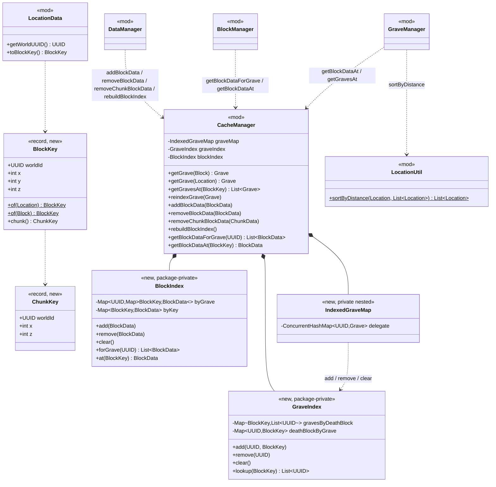
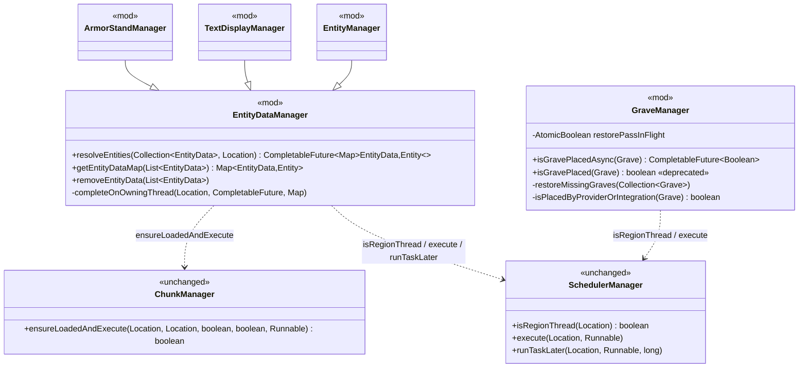
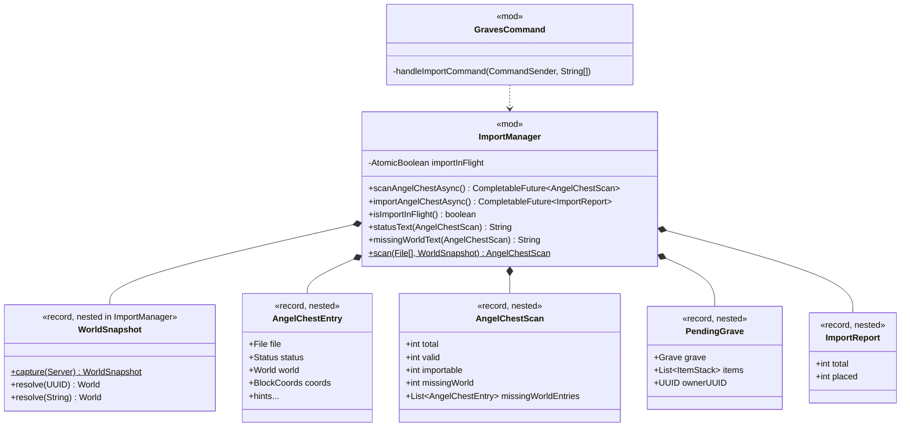

# Phase 1 LLD: Main-Thread Stall Remediation

> **Audit Reference:** No HLD exists for this work. The motivating evidence is recorded inline in
> [Background: Audit Findings](#background-audit-findings) so this document stands alone.
> **Status:** Proposed (revision 2 — incorporates the design review of 2026-09-23)
> **Last Updated:** 2026-09-23
> **Target version:** `2026.4.9.3` (new members carry `@since 2026.4.9.3`; deprecations are scheduled for removal in `2027.4.9.1`, the repository's current removal target)

---

## Table of Contents

- [Scope](#scope)
- [Background: Audit Findings](#background-audit-findings)
- [Class Diagrams](#class-diagrams)
- [1. WP1 — Grave & Block Location Index](#1-wp1--grave--block-location-index)
- [2. WP2 — Future-Based Entity Resolution & Placement Checks](#2-wp2--future-based-entity-resolution--placement-checks)
- [3. WP3 — Asynchronous AngelChest Import](#3-wp3--asynchronous-angelchest-import)
- [4. WP4 — Lazy Debug Messages](#4-wp4--lazy-debug-messages)
- [5. Deprecations and Deletions](#5-deprecations-and-deletions)
- [6. Key Flows](#6-key-flows)
- [7. Implementation Order](#7-implementation-order)
- [8. Unit Tests](#8-unit-tests)
- [9. Resolved Design Decisions](#9-resolved-design-decisions)
- [10. Open Items / Future Considerations](#10-open-items--future-considerations)
- [File Changes Summary](#file-changes-summary)

---

## Scope

This phase removes the four main-thread cost centres identified by the September 2026 performance audit. Each work package is independent and lands as its own reviewable batch. Every observable behaviour change is declared in [§9](#9-resolved-design-decisions); there are two (D6 and D12).

| Work Package | Problem | Fix Shape | Files |
|---|---|---|---|
| **WP1** | `isNearGrave` is O(graves × chunks); `CacheManager.getGrave(Block/Location)` is O(graves). Both are wired into the highest-frequency block events in the game. | Two pure index types (`GraveIndex`, `BlockIndex`) owned by `CacheManager`, keyed by a new `BlockKey` value type, maintained at the existing cache write choke points. | 9 modified + 4 new + 5 tests |
| **WP2** | `EntityDataManager` blocks the main thread on a `CountDownLatch` waiting for a task it has queued *behind itself*; `GraveManager.isGravePlaced` does the same with `Future.get(100ms)`. Every wait burns its full timeout and returns a null result. | Replace the blocking waits with `CompletableFuture` pipelines that complete on the owning thread of an explicit anchor; run inline when already on that thread. | 6 modified |
| **WP3** | `/graves import angelchest` calls `callSyncMethod(...).get()` with no timeout from the main thread — a permanent server hang — and re-parses every AngelChest YAML file three times. | Move file I/O and parsing to an async task; snapshot worlds on the main thread first; place graves back on the owning thread in bounded per-tick batches. Orchestration lives in `ImportManager`. | 2 modified + 1 test |
| **WP4** | 337 `debugMessage("..." + x)` call sites eagerly build strings that are discarded because debug is off; `DebugManager.isEnabled` re-reads the YAML config path on every call. | `Supplier<String>` overload, cached debug settings, and a sweep of the tick/event hot paths. | 12 modified |

**In scope:**

- `BlockKey` / `ChunkKey` value types derivable from `LocationData` without touching Bukkit (WP1)
- `GraveIndex` and `BlockIndex`, pure over `BlockKey`, owned by `CacheManager`; a thin index-maintaining view for `getGraveMap()` (WP1)
- Index maintenance at the `DataManager` block/chunk mutators; `BlockManager` and `GraveManager` lookups rewritten on the indexes (WP1)
- `LocationUtil.sortByDistance` replacing the tie-dropping `TreeMap` ordering (WP1)
- `EntityDataManager.resolveEntities` with a deterministic completion thread; non-blocking `getEntityDataMap` / `removeEntityData` (WP2)
- `GraveManager.isGravePlacedAsync` with a corrected placement heuristic, and a guarded, future-driven `restoreMissingGraves` (WP2)
- Async AngelChest scan/import pipeline inside `ImportManager`; `GravesCommand` only renders messages (WP3)
- `DebugManager` settings cache + `Supplier` overloads, and conversion of hot-path call sites (WP4)
- Minimal JUnit 5 + Mockito test infrastructure — the first tests in this repository. No MockBukkit: every test constructs real data objects and mocks at most `World`.

**Out of scope (tracked in [Open Items](#10-open-items--future-considerations)):**

- `StringUtil.parseString` per-line cost; `ConfigManager.getConfigSection` memoisation
- The `return`-instead-of-`continue` bug in `GraveManager.processChunks` (deliberately left; Open Item 1)
- `EntityDataManager.getLoadedEntityDataList` O(chunks) scan
- Converting integration `removeFurniture` paths to the async resolver
- `SafeLocationManager` fluid-column O(depth²) rescan
- The remaining (non-hot-path) debug string conversions

**Configuration, changelog, migration:** no config keys are added or changed; no data migration is required; the changelog entries are the two declared behaviour changes (D6, D12) and the deprecations in [§5](#5-deprecations-and-deletions).

---

## Background: Audit Findings

Three independent audits (database/IO, thread synchronisation, algorithmic cost) were run against commit `ad6888b`, followed by a two-lens design review of revision 1 of this document. Every finding below was re-verified by reading the code. Line numbers refer to `ad6888b`.

### F1 — Self-deadlock-until-timeout in `EntityDataManager` (CRITICAL, no config gate)

`EntityDataManager.java:225`, `:309`, `:380` call `latch.await(25L, MILLISECONDS)` on the calling thread. The latch is only counted down inside a task handed to `ChunkManager.ensureLoadedAndExecute`, which for an already-loaded chunk (`ChunkManager.java:146-149`) dispatches via `execute(anchor, task)` → `SchedulerManager.runTask(task)` (`ChunkManager.java:189`). `SchedulerManager.runTask` is a pass-through to the shaded `me.croabeast.scheduler.GlobalScheduler` 1.1, which hands the task to `Bukkit.getScheduler().runTask` (Spigot) or `GlobalRegionScheduler.run` (Paper, Folia) — an unconditional next-tick dispatch with no primary-thread fast path on any implementation (verified from the shaded bytecode; see §2.1 and D8). When the caller *is* the main thread, the task cannot run until the caller returns; the wait burns the full 25 ms, `ref.get()` is `null`, and the entity is silently dropped from the result map.

Reached from: the sync 1-second timer (`GraveManager.java:76` → `removeExpiredElements` → `removeEntityData` → `HologramManager.removeHologram` → `ArmorStandManager.java:220`), `BlockBreakListener.java:112`, `InventoryCloseListener.java:117`, and `/graves purge`. Traversed three times per grave removal. Cost: 25 ms × unresolved entities × 3 per removal; a mass-expiry tick stalls for seconds.

`Bukkit.getEntity(UUID)` (the `fastGetEntity` path) is available on every server this plugin supports (`api-version: 1.13`) and finds every loaded entity. The chunk scan therefore only ever adds value when the chunk is **unloaded** — the exact case the latch path is guaranteed to lose.

### F2 — Same pattern in `GraveManager.isGravePlaced`, and the feature it gates is dormant (HIGH when enabled)

`GraveManager.java:1512-1540`: schedules the world check via `execute(location, ...)` (next tick) then `result.get(100, MILLISECONDS)` on the main thread. Always times out from the main thread and returns `true` ("assume placed").

The design review corrected revision 1's cost model: the **caller** adds the grave to `knownGraves` in its `else` branch (`:1444-1446`), so every grave is checked exactly once — a one-time N × 100 ms stall on the first pass after a removal, not a recurring one. The nested double-check at `:1436` also always times out to `true`, so **`placeGrave` has never executed from this path on Paper**. `grave.check-missing-graves` (default `false`, `grave.yml:29`) is effectively a dormant feature with a startup stall.

The world heuristic that the timeout has been hiding is also wrong: `:1514-1528` reports a grave as missing whenever `getNearbyEntities(±0.49)` is empty, regardless of whether its block is intact. Waking the feature up without fixing that would re-place every grave on the server (duplicate block rows, duplicate hologram stacks). WP2 fixes the heuristic (D12) and declares the feature's activation as a behaviour change.

### F3 — O(G × C) `isNearGrave` on block events (CRITICAL)

`GraveManager.isNearGrave` (`:2573`) iterates every cached grave and, per grave, calls `getGraveLocation` (`:2409`) → `getGraveLocationList` (`:2371`) → `BlockManager.getBlockList` (`:193`), which walks the **entire** chunk map and allocates one `ArrayList` per chunk to find the one or two blocks belonging to that grave. At 1,000 graves that is ~10⁶ iterations and ~10⁶ allocations per call. Call sites: `EntityChangeListener:36`, `BlockBurnAndIgniteListener:33,45-46,59-60`, `BlockPlaceListener:39`, `BlockBreakListener:57`, `PlayerTeleportListener:53`, `PlayerBucketListener:41,59`.

`CacheManager.getGrave(Block)` (`:268`) and `getGrave(Location)` (`:319`) are linear scans over the grave map comparing block coordinates of `grave.getLocationDeath()` — which itself allocates a fresh `Location` and does a `Bukkit.getWorld(UUID)` lookup per call (`LocationData.java:110-125`). Called from `BlockFromToListener:43` on **every fluid-flow update** at `MONITOR`, plus `ProjectileHitListener:36`, `BlockBreakListener:44`, `BlockPlaceListener:35`, `BlockPistonExtendListener:47`, `PlayerInteractListener:114,119`.

### F4 — Untimed `callSyncMethod(...).get()` on the command thread (server hang)

`ImportManager.java:279`, `:459`, `:469`, `:478` and `:380` call `callSyncMethod(...).get()` with no timeout. The shim's `callSyncMethod` is an interface default that schedules via `execute(Runnable)` and completes a `CompletableFuture` on success only — if the callable throws, the lambda rethrows without `completeExceptionally`, so `.get()` hangs from **any** thread, not just the one that must run the task. `GravesCommand` contains no async dispatch; `handleImportCommand` (`:1059`) runs on the main thread and calls `countAngelChestStatusText()` (`:1085`) on the **dry run**, before `confirm`. `countAngelChestStatusText` → `resolveWorldForScan` (`:128` → `:454`) → `.get()`. The scheduled callable can never run; the server hangs permanently. The dry run also parses every AngelChest YAML file three times.

### F5 — Eager debug string construction (MEDIUM, sustained)

468 `debugMessage(...)` call sites, 337 of which concatenate a string argument that is built before the level check. `DebugManager.isEnabled` (`:79-95`) reads `plugin.getConfig().getInt("settings.debug.level", 0)` per call — a `ConfigManager.config()` read-lock plus a dotted YAML path walk. Hot examples: `GraveManager.java:124-127` (per grave, per second, including `formatMillis`), `PermissionManager.java:43-54` (three concatenations per permission check at severity 4 — a level that **never prints** — on the `PlayerMoveEvent` path), `ArmorStandManager` / `TextDisplayManager` removal paths.

### Cleared

The database layer is not a contributor: every runtime write goes through `DataManager.runAsyncDatabaseTask` (`:78-98`) to a real async thread, config reads are in-memory, and no JDBC or disk I/O occurs in any listener. No 1-tick timers exist. No lock convoys exist. After WP2 no blocking wait of any kind remains in `src/main/java` (sweep: `.get(n, unit)`, `.join()`, `await(`, `CountDownLatch`, `Thread.sleep`, `callSyncMethod(...).get()` — only the sites this LLD removes, plus the intentional shutdown drain at `DataManager.java:100-124`).

---

## Class Diagrams

### Legend

- Solid arrows: composition / ownership
- Dashed arrows: calls
- `«new»`: introduced by this LLD
- `«mod»`: existing class modified by this LLD

### Diagram 1: WP1 — Location Indexes



### Diagram 2: WP2 — Entity Resolution & Placement Checks



### Diagram 3: WP3 — Async Import Pipeline



---

## Conventions for all new code

These apply to every work package and are restated here so the implementation PR is not sparser or looser than the classes it lands in.

- **Javadoc:** every new type and every new method, including private ones, carries a javadoc in the style of the host class (`CacheManager`, `EntityDataManager` and `ChunkData` document even trivial accessors). New public members carry `@since 2026.4.9.3`.
- **Nullability:** every new public and package-private member is annotated with `org.jetbrains.annotations.@NotNull` / `@Nullable` on parameters and return types, matching `SchedulerManager` and the `dev.cwhead.GravesX.api` package. Existing un-annotated methods that are rewritten in place are not retro-annotated.
- **Server access:** new code reaches the server through `plugin.getServer()`, never through `Bukkit.*` statics (the codebase prefers the former roughly 7:1).
- **Threading:** the only thread predicate is `SchedulerManager.isRegionThread(location)`, called only with a non-null world; location work is dispatched with `execute(location, r)`, entity work with `execute(entity, r)`; `callSyncMethod(...).get()` is never used (see §2.1 for the bytecode-derived rules).
- **Exceptions:** new code does not swallow `Throwable`. Existing `catch (Throwable ignored)` blocks are removed only where the replaced body is provably non-throwing on valid input; otherwise they are kept as-is.
- **Debug messages:** new messages use the host class's existing prefix (`[Holograms]` in the hologram managers, none in `GraveManager` / `EntityDataManager`) and are written as suppliers from the start.
- **Deprecation:** repository standard — `@Deprecated(since = "2026.4.9.3", forRemoval = true)`, `@ApiStatus.ScheduledForRemoval(inVersion = "2027.4.9.1")`, and a javadoc line "Deprecated as of 2026.4.9.3 and scheduled for removal in 2027.4.9.1. Use {@link …} instead." (see `DataManager.java:2255-2262`).

---

## 1. WP1 — Grave & Block Location Index

### 1.1 New: `com.ranull.graves.data.BlockKey` and `ChunkKey`

Immutable coordinate keys. World identity is by `World.getUID()` so keys survive world unload/reload and never hold a `World` reference. Coordinates use floor semantics (`getBlockX/Y/Z`), matching the comparisons `CacheManager.getGrave(Block)` and `GraveManager.isNearGrave` perform today. They live next to `LocationData` / `BlockData` / `ChunkData` because they are value types over the same data.

```java
package com.ranull.graves.data;

/**
 * Immutable block-coordinate key: world UID plus floored block coordinates.
 * <p>
 * Used by {@code CacheManager} to index graves and grave blocks by position without holding
 * {@link org.bukkit.World} references or relying on {@link Location#equals(Object)} (which also
 * compares yaw and pitch).
 *
 * @param worldId the world's {@link org.bukkit.World#getUID() UID}
 * @param x       block X (floored)
 * @param y       block Y (floored)
 * @param z       block Z (floored)
 * @since 2026.4.9.3
 */
public record BlockKey(@NotNull UUID worldId, int x, int y, int z) {

    /** Builds a key for the block containing {@code location}; {@code null} if the location or its world is {@code null}. */
    public static @Nullable BlockKey of(@Nullable Location location) {
        if (location == null || location.getWorld() == null) return null;
        return new BlockKey(location.getWorld().getUID(),
                location.getBlockX(), location.getBlockY(), location.getBlockZ());
    }

    /** Builds a key for {@code block}; {@code null} if the block is {@code null}. */
    public static @Nullable BlockKey of(@Nullable Block block) {
        if (block == null) return null;
        return new BlockKey(block.getWorld().getUID(), block.getX(), block.getY(), block.getZ());
    }

    /** The chunk containing this block. */
    public @NotNull ChunkKey chunk() {
        return new ChunkKey(worldId, x >> 4, z >> 4);
    }
}
```

```java
package com.ranull.graves.data;

/**
 * Immutable chunk-coordinate key: world UID plus chunk X/Z.
 *
 * @since 2026.4.9.3
 */
public record ChunkKey(@NotNull UUID worldId, int x, int z) {}
```

### 1.2 `LocationData` — Bukkit-free key derivation

**File:** `src/main/java/com/ranull/graves/data/LocationData.java`

`LocationData` already stores the world UID and coordinates as fields (`:27, :64-80`). Two accessors let the index derive a key **without** `getLocation()`'s `Bukkit.getWorld(UUID)` lookup and `Location` allocation (`:110-125`) — the cost the review found revision 1 re-introducing on every cache write and index hit.

```java
/** The stored world UID, or {@code null} if the serialised location had no world. @since 2026.4.9.3 */
public @Nullable UUID getWorldUUID() { return uuid; }

/**
 * The block key of this location, computed from the stored fields without resolving the world.
 *
 * @return the key, or {@code null} if no world UID was stored
 * @since 2026.4.9.3
 */
public @Nullable BlockKey toBlockKey() {
    if (uuid == null) return null;
    return new BlockKey(uuid, (int) Math.floor(x), (int) Math.floor(y), (int) Math.floor(z));
}
```

`Math.floor` matches `Location.getBlockX/Y/Z` (`NumberConversions.floor`).

### 1.3 New: `com.ranull.graves.manager.GraveIndex` (package-private)

Death-block ↔ grave index. Multi-valued per block (D3): two graves *can* share a death block through `GraveCreationAPI` or an import, and `getGrave(Location)` must keep returning the earliest one, as the old map-order scan did. Pure over `UUID` / `BlockKey`; no Bukkit, no plugin reference; fully unit-testable.

```java
/**
 * Index from death-block position to grave UUIDs and back. Thread-safe; reads never block.
 * <p>
 * Owned and maintained by {@link CacheManager}. Per-key lists are copy-on-write: they are tiny
 * (almost always one element) and written only when a grave is added or removed.
 *
 * @since 2026.4.9.3
 */
final class GraveIndex {
    private final Map<BlockKey, List<UUID>> gravesByDeathBlock = new ConcurrentHashMap<>();
    private final Map<UUID, BlockKey> deathBlockByGrave = new ConcurrentHashMap<>();

    /** Records {@code graveUUID} at {@code key}, replacing any previous position for that grave. */
    void add(@NotNull UUID graveUUID, @NotNull BlockKey key) {
        remove(graveUUID);
        deathBlockByGrave.put(graveUUID, key);
        gravesByDeathBlock.computeIfAbsent(key, k -> new CopyOnWriteArrayList<>()).addIfAbsent(graveUUID);
    }

    /** Forgets {@code graveUUID}. No-op if unknown. */
    void remove(@NotNull UUID graveUUID) {
        BlockKey old = deathBlockByGrave.remove(graveUUID);
        if (old == null) return;
        gravesByDeathBlock.computeIfPresent(old, (k, list) -> {
            list.remove(graveUUID);
            return list.isEmpty() ? null : list;
        });
    }

    void clear() {
        gravesByDeathBlock.clear();
        deathBlockByGrave.clear();
    }

    /** Grave UUIDs recorded at {@code key}, earliest first. Never {@code null}; the list is a safe-to-iterate snapshot. */
    @NotNull List<UUID> lookup(@Nullable BlockKey key) {
        if (key == null) return List.of();
        List<UUID> list = gravesByDeathBlock.get(key);
        return list != null ? List.copyOf(list) : List.of();
    }

    /** The recorded death block of {@code graveUUID}, or {@code null}. */
    @Nullable BlockKey keyOf(@NotNull UUID graveUUID) { return deathBlockByGrave.get(graveUUID); }
}
```

### 1.4 New: `com.ranull.graves.manager.BlockIndex` (package-private)

Grave → placed blocks and position → block. `BlockData` has identity equality, so `remove(key, value)` semantics are exact. On an overwrite at the same key (the chunk map's `put` semantics for an equal `Location`), the previous `BlockData` is unlinked from its grave so `byGrave` cannot drift (review finding M1).

```java
/**
 * Index of placed grave blocks: by owning grave, and by block position. Thread-safe.
 * <p>
 * Owned and maintained by {@link CacheManager}. Every {@link BlockData} that enters or leaves
 * {@link ChunkData#getBlockDataMap()} must pass through {@link #add} / {@link #remove}.
 *
 * @since 2026.4.9.3
 */
final class BlockIndex {
    private final Map<UUID, Map<BlockKey, BlockData>> byGrave = new ConcurrentHashMap<>();
    private final Map<BlockKey, BlockData> byKey = new ConcurrentHashMap<>();

    /** Records {@code blockData}; unlinks any different {@code BlockData} previously recorded at the same key. Idempotent. */
    void add(@NotNull BlockData blockData) {
        UUID graveUUID = blockData.getGraveUUID();
        BlockKey key = BlockKey.of(blockData.getLocation());
        if (graveUUID == null || key == null) return;

        BlockData previous = byKey.put(key, blockData);
        if (previous != null && previous != blockData) unlink(previous, key);
        byGrave.computeIfAbsent(graveUUID, g -> new ConcurrentHashMap<>()).put(key, blockData);
    }

    /** Forgets {@code blockData}. No-op if unknown or if a different {@code BlockData} now occupies its key. */
    void remove(@NotNull BlockData blockData) {
        BlockKey key = BlockKey.of(blockData.getLocation());
        if (key == null) return;
        byKey.remove(key, blockData);
        unlink(blockData, key);
    }

    void clear() {
        byGrave.clear();
        byKey.clear();
    }

    /** Snapshot of the blocks recorded for {@code graveUUID}; never {@code null}. */
    @NotNull List<BlockData> forGrave(@Nullable UUID graveUUID) {
        Map<BlockKey, BlockData> perGrave = graveUUID != null ? byGrave.get(graveUUID) : null;
        return perGrave != null ? List.copyOf(perGrave.values()) : List.of();
    }

    /** The block recorded at {@code key}, or {@code null}. */
    @Nullable BlockData at(@Nullable BlockKey key) { return key != null ? byKey.get(key) : null; }

    private void unlink(@NotNull BlockData blockData, @NotNull BlockKey key) {
        UUID graveUUID = blockData.getGraveUUID();
        if (graveUUID == null) return;
        byGrave.computeIfPresent(graveUUID, (g, perGrave) -> {
            perGrave.remove(key, blockData);
            return perGrave.isEmpty() ? null : perGrave;
        });
    }
}
```

`computeIfPresent` performs the remove-and-maybe-drop atomically, closing the lost-update window the review found (LOW-4) when two region threads touch the same grave's blocks.

### 1.5 `CacheManager` — Ownership, the `getGraveMap()` view, and the public index API

**File:** `src/main/java/com/ranull/graves/manager/CacheManager.java`

`CacheManager` already owns an explicit index (`entityMap` + `addEntityData` / `removeEntityData` / `getEntityData`, `:76, :356-401`). The new members follow that naming.

#### New fields

```java
private final GraveIndex graveIndex = new GraveIndex();
private final BlockIndex blockIndex = new BlockIndex();
```

`graveMap` changes from `new HashMap<>()` to `new IndexedGraveMap()`. Its declared type stays `Map<UUID, Grave>` and `getGraveMap()` is unchanged, so **no writer or reader of the grave map needs to change** (D2).

#### New private nested class: `IndexedGraveMap`

The view's only job is to call `graveIndex.add/remove/clear` from every `Map` mutation path. All `java.util.Map` default methods (`putIfAbsent`, `compute*`, `merge`, `replace`, `remove(k, v)`, `replaceAll`) are implemented in terms of `get` / `put` / `remove` / `entrySet()`, so overriding those plus `clear`, `putAll` and the entry iterator covers every path. Entries are wrapped so `Entry.setValue` routes through `put` (review LOW-3). Null keys return `null` / `false` as `HashMap` did rather than throwing as `ConcurrentHashMap` does (review M3) — six call sites pass an unguarded `getGraveUUID()` that MultiPaper-deserialised data can null.

```java
/**
 * {@code Map<UUID, Grave>} view over a {@link ConcurrentHashMap} whose mutators keep
 * {@link #graveIndex} in step. Backed by a concurrent map so the async database loader and
 * the main-thread timer can no longer race a {@code HashMap} (D2).
 */
private final class IndexedGraveMap extends AbstractMap<UUID, Grave> {
    private final ConcurrentHashMap<UUID, Grave> delegate = new ConcurrentHashMap<>();

    @Override public Grave get(Object key) { return key == null ? null : delegate.get(key); }
    @Override public boolean containsKey(Object key) { return key != null && delegate.containsKey(key); }
    @Override public int size() { return delegate.size(); }

    @Override
    public Grave put(UUID key, Grave value) {
        Grave previous = delegate.put(key, value);
        indexDeath(key, value);
        return previous;
    }

    @Override
    public Grave remove(Object key) {
        if (key == null) return null;
        Grave removed = delegate.remove(key);
        if (removed != null && key instanceof UUID uuid) graveIndex.remove(uuid);
        return removed;
    }

    @Override public void putAll(Map<? extends UUID, ? extends Grave> m) { m.forEach(this::put); }

    @Override
    public void clear() {
        delegate.clear();
        graveIndex.clear();
    }

    @Override
    public Set<Entry<UUID, Grave>> entrySet() {
        return new AbstractSet<>() {
            @Override public int size() { return delegate.size(); }
            @Override public Iterator<Entry<UUID, Grave>> iterator() {
                Iterator<Entry<UUID, Grave>> it = delegate.entrySet().iterator();
                return new Iterator<>() {
                    private Entry<UUID, Grave> current;
                    @Override public boolean hasNext() { return it.hasNext(); }
                    @Override public Entry<UUID, Grave> next() {
                        current = it.next();
                        return new IndexedEntry(current);
                    }
                    @Override public void remove() {
                        it.remove();
                        if (current != null) graveIndex.remove(current.getKey());
                    }
                };
            }
        };
    }

    /** Entry whose {@code setValue} writes through {@link #put} so the index sees it. */
    private final class IndexedEntry implements Entry<UUID, Grave> {
        private final Entry<UUID, Grave> delegateEntry;
        IndexedEntry(Entry<UUID, Grave> delegateEntry) { this.delegateEntry = delegateEntry; }
        @Override public UUID getKey() { return delegateEntry.getKey(); }
        @Override public Grave getValue() { return delegateEntry.getValue(); }
        @Override public Grave setValue(Grave value) { return put(getKey(), value); }
        @Override public boolean equals(Object o) { return o instanceof Entry<?, ?> e && Objects.equals(getKey(), e.getKey()) && Objects.equals(getValue(), e.getValue()); }
        @Override public int hashCode() { return Objects.hashCode(getKey()) ^ Objects.hashCode(getValue()); }
    }
}
```

`remove` deliberately does **not** touch `blockIndex` (review M1): `DataManager.removeGrave(UUID)` (`:2388`, the MultiPaper path) removes the grave from the map *before* `BlockManager.removeBlock(Grave)` needs the block list. Block index entries die with `removeBlockData` / `removeChunkBlockData` / `rebuildBlockIndex`.

#### New private helpers

```java
/** Indexes {@code grave}'s death block from its stored {@link LocationData} — no world lookup, no allocation. */
private void indexDeath(@NotNull UUID graveUUID, @Nullable Grave grave) {
    BlockKey key = grave != null && grave.getLocationDeathData() != null ? grave.getLocationDeathData().toBlockKey() : null;
    if (key != null) graveIndex.add(graveUUID, key);
    else graveIndex.remove(graveUUID);
}

/** Cached graves whose stored death block is {@code key}, earliest-inserted first; stale entries are dropped on the way. */
private @NotNull List<Grave> gravesAtDeathBlock(@Nullable BlockKey key) {
    List<UUID> uuids = graveIndex.lookup(key);
    if (uuids.isEmpty()) return List.of();

    List<Grave> graves = new ArrayList<>(uuids.size());
    for (UUID uuid : uuids) {
        Grave grave = graveMap.get(uuid);
        BlockKey current = grave != null && grave.getLocationDeathData() != null ? grave.getLocationDeathData().toBlockKey() : null;
        if (grave != null && key.equals(current)) {
            graves.add(grave);
        } else {
            // Self-heal: the grave was removed, or its death location changed without reindexGrave().
            graveIndex.remove(uuid);
        }
    }
    return graves;
}
```

#### Modified public methods

**Before:** linear scans over `graveMap.values()` comparing `grave.getLocationDeath()` block coordinates (`:268-285`, `:319-335`).

**After:**

```java
public Grave getGrave(Block block) {
    List<Grave> graves = gravesAtDeathBlock(BlockKey.of(block));
    return graves.isEmpty() ? null : graves.get(0);
}

public Grave getGrave(Location location) {
    List<Grave> graves = gravesAtDeathBlock(BlockKey.of(location));
    return graves.isEmpty() ? null : graves.get(0);
}
```

#### New public methods

```java
/** All cached graves whose death block is {@code key}, earliest-inserted first. @since 2026.4.9.3 */
public @NotNull List<Grave> getGravesAt(@Nullable BlockKey key) { return gravesAtDeathBlock(key); }

/**
 * Re-indexes a cached grave after its death location changed. Must be called by any code that
 * invokes {@link Grave#setLocationDeath(Location)} on a grave already in the cache.
 * @since 2026.4.9.3
 */
public void reindexGrave(@Nullable Grave grave) {
    if (grave == null || grave.getUUID() == null) return;
    if (graveMap.containsKey(grave.getUUID())) indexDeath(grave.getUUID(), grave);
    else graveIndex.remove(grave.getUUID());
}

/** Records a placed grave block in the index. Idempotent. @since 2026.4.9.3 */
public void addBlockData(@Nullable BlockData blockData) { if (blockData != null) blockIndex.add(blockData); }

/** Forgets a placed grave block. No-op if unknown. @since 2026.4.9.3 */
public void removeBlockData(@Nullable BlockData blockData) { if (blockData != null) blockIndex.remove(blockData); }

/** Forgets every block of a chunk being dropped from the cache. @since 2026.4.9.3 */
public void removeChunkBlockData(@Nullable ChunkData chunkData) {
    if (chunkData == null) return;
    for (BlockData blockData : new ArrayList<>(chunkData.getBlockDataMap().values())) blockIndex.remove(blockData);
}

/**
 * Re-adds every block in the chunk map to the index. Additive and idempotent: it never clears, so
 * it is safe to run while other threads are still writing (D4).
 * @since 2026.4.9.3
 */
public void rebuildBlockIndex() {
    for (ChunkData chunkData : new ArrayList<>(chunkMap.values())) {
        for (BlockData blockData : new ArrayList<>(chunkData.getBlockDataMap().values())) blockIndex.add(blockData);
    }
}

/** Snapshot of the blocks recorded for {@code graveUUID}; never {@code null}. @since 2026.4.9.3 */
public @NotNull List<BlockData> getBlockDataForGrave(@Nullable UUID graveUUID) { return blockIndex.forGrave(graveUUID); }

/** The grave block recorded at {@code key}, or {@code null}. @since 2026.4.9.3 */
public @Nullable BlockData getBlockDataAt(@Nullable BlockKey key) { return blockIndex.at(key); }
```

### 1.6 `DataManager` — Index maintenance at the block/chunk choke points

**File:** `src/main/java/com/ranull/graves/manager/DataManager.java`

`ChunkData.addBlockData` / `removeBlockData` are called from exactly three places, all in `DataManager` (`:1680`, `:1985/1987`, `:2027`); `removeChunkData` (`:899`) drops whole chunks; `MultiPaper.java:147` routes through `DataManager.addBlockData`. These four sites are the complete set of index hooks (D5). The invariant is documented on `BlockIndex` and backed by the additive `rebuildBlockIndex()` after load.

#### `addBlockData(BlockData)` — `:1979`

**Before:**

```java
if (loc != null && loc.getWorld() != null && plugin.getVersionManager().isFolia()) {
    plugin.getSchedulerManager().execute(loc, () -> getChunkData(loc).addBlockData(blockData));
} else {
    Objects.requireNonNull(getChunkData(loc)).addBlockData(blockData);
}
```

**After:**

```java
if (loc != null && loc.getWorld() != null && plugin.getVersionManager().isFolia()) {
    plugin.getSchedulerManager().execute(loc, () -> {
        getChunkData(loc).addBlockData(blockData);
        plugin.getCacheManager().addBlockData(blockData);
    });
} else {
    Objects.requireNonNull(getChunkData(loc)).addBlockData(blockData);
    plugin.getCacheManager().addBlockData(blockData);
}
```

#### `removeBlockData(Location)` — `:2019`

**Before:**

```java
plugin.getSchedulerManager().execute(location, () -> {
    ChunkData chunkData = getChunkData(location);
    if (chunkData != null) chunkData.removeBlockData(location);
});
```

**After:**

```java
plugin.getSchedulerManager().execute(location, () -> {
    ChunkData chunkData = getChunkData(location);
    if (chunkData != null) {
        BlockData removed = chunkData.getBlockDataMap().get(location);
        chunkData.removeBlockData(location);
        plugin.getCacheManager().removeBlockData(removed);
    }
});
```

#### `removeChunkData(ChunkData)` — `:899`

Add `plugin.getCacheManager().removeChunkBlockData(chunkData);` immediately after the null checks, before either `chunkMap.remove(key)` branch.

#### `loadBlockMap()` — `:1620`

Two changes:

1. The per-chunk apply lambda at `:1680` gains `plugin.getCacheManager().addBlockData(w.data);` after `addBlockData(w.data)`.
2. The rebuild runs only after the **last** group has applied, not on a separately scheduled global task (review H4: on Folia the global scheduler has no ordering guarantee against region tasks, and a `clear()`-then-iterate over a `HashMap` mid-insert threw `ConcurrentModificationException` and left the index half-empty). An `AtomicInteger remaining = new AtomicInteger(byChunk.size())` is decremented in a `finally` inside each group's lambda; the thread that brings it to zero calls `plugin.getCacheManager().rebuildBlockIndex()`. If `byChunk` is empty no rebuild is needed. Because the rebuild is additive and idempotent, a runtime write that interleaves is harmless.

### 1.7 `BlockManager` — Index-backed lookups

**File:** `src/main/java/com/ranull/graves/manager/BlockManager.java`

**Before** (`:173-205`): `getBlockDataList` / `getBlockList` walk the whole chunk map allocating an `ArrayList` per chunk. `getBlockData(Block)` (`:48-58`) builds two chunk-key strings and up to three `Location`s per call.

**After:**

```java
public BlockData getBlockData(Block block) {
    return plugin.getCacheManager().getBlockDataAt(BlockKey.of(block));
}

public List<BlockData> getBlockDataList(Grave grave) {
    if (grave == null) return new ArrayList<>();
    return new ArrayList<>(plugin.getCacheManager().getBlockDataForGrave(grave.getUUID()));
}

public List<Location> getBlockList(Grave grave) {
    List<Location> locationList = new ArrayList<>();
    for (BlockData blockData : getBlockDataList(grave)) locationList.add(blockData.getLocation());
    return locationList;
}
```

`BlockData.getLocation()` returns a clone (`BlockData.java:69`), so `getBlockList`'s contract — fresh `Location` objects — is unchanged.

**`removeBlock(Grave)`** (`:212`) — preserves the loaded-chunk filter without the scan:

```java
public void removeBlock(Grave grave) {
    for (BlockData blockData : getBlockDataList(grave)) {
        Location location = blockData.getLocation();
        World world = location.getWorld();
        if (world != null && world.isChunkLoaded(location.getBlockX() >> 4, location.getBlockZ() >> 4)) removeBlock(blockData);
    }
}
```

### 1.8 `LocationUtil.sortByDistance`

**File:** `src/main/java/com/ranull/graves/util/LocationUtil.java`

A public, javadoc'd static next to the existing `getClosestLocation` (`:84`), used by `GraveManager.getGraveLocationList` and unit-tested directly (review M6 — no test-only package-private helper on `GraveManager`).

```java
/**
 * Orders {@code locations} by squared distance from {@code base}. Locations in {@code base}'s world
 * come first, nearest first, with a stable sort so equal distances keep their input order; locations
 * in other worlds (or with no world) follow in input order. {@code null} entries are skipped.
 *
 * @since 2026.4.9.3
 */
public static @NotNull List<Location> sortByDistance(@NotNull Location base, @NotNull List<Location> locations) {
    World baseWorld = base.getWorld();
    List<Location> sameWorld = new ArrayList<>(locations.size());
    List<Location> otherWorld = new ArrayList<>();
    for (Location location : locations) {
        if (location == null) continue;
        (baseWorld != null && baseWorld.equals(location.getWorld()) ? sameWorld : otherWorld).add(location);
    }
    sameWorld.sort(Comparator.comparingDouble(base::distanceSquared));
    sameWorld.addAll(otherWorld);
    return sameWorld;
}
```

### 1.9 `GraveManager` — `getGraveLocationList` and `isNearGrave`

**File:** `src/main/java/com/ranull/graves/manager/GraveManager.java`

#### `getGraveLocationList(Location, Grave)` — `:2371`

**Before:** copies `getBlockList`, appends the death location if absent (only when `baseLocation.getWorld() != null`), then buckets by `distanceSquared` into a `HashMap<Double, Location>` and copies through a `TreeMap` — which silently **drops** any two locations at identical distance.

**After** (the null-world-base early return is preserved exactly — review LOW-2):

```java
public List<Location> getGraveLocationList(Location baseLocation, Grave grave) {
    if (baseLocation == null || grave == null) return new ArrayList<>();

    List<Location> locationList = plugin.getBlockManager().getBlockList(grave);
    if (baseLocation.getWorld() == null) return locationList;

    Location death = grave.getLocationDeath();
    if (death != null && !locationList.contains(death)) locationList.add(death);
    return LocationUtil.sortByDistance(baseLocation, locationList); // stable; ties kept (D6)
}
```

#### `isNearGrave(Location, Player, Block)` — `:2573`

The current predicate is: *there exists a grave whose nearest location (to `base`, among its placed blocks ∪ death location) has the same block coordinates as `location`*. A grave can only satisfy this if `location`'s block **is** one of its placed blocks or its death block. Both are O(1) index lookups, so only the candidate graves need the nearest-location check — an exact reformulation (D7), including the shared-death-block case now that `getGravesAt` is multi-valued.

**After:**

```java
public boolean isNearGrave(Location location, Player player, Block block) {
    if (location == null || location.getWorld() == null) return false;

    BlockKey key = BlockKey.of(location);
    CacheManager cache = plugin.getCacheManager();

    BlockData blockData = cache.getBlockDataAt(key);
    List<Grave> byDeath = cache.getGravesAt(key);
    if (blockData == null && byDeath.isEmpty()) return false; // the overwhelmingly common exit: no allocation

    Location base = (player != null) ? player.getLocation()
            : (block != null) ? block.getLocation()
            : location;

    List<Grave> candidates = new ArrayList<>(byDeath.size() + 1);
    Grave byBlock = blockData != null ? cache.getGrave(blockData.getGraveUUID()) : null;
    if (byBlock != null) candidates.add(byBlock);
    for (Grave grave : byDeath) if (!candidates.contains(grave)) candidates.add(grave);

    for (Grave grave : candidates) {
        Location nearest = getGraveLocation(base, grave);
        if (nearest != null && nearest.getWorld() != null
                && nearest.getWorld().equals(location.getWorld())
                && nearest.getBlockX() == location.getBlockX()
                && nearest.getBlockY() == location.getBlockY()
                && nearest.getBlockZ() == location.getBlockZ()) {
            return true;
        }
    }
    return false;
}
```

The `catch (Throwable ignored)` wrapper is dropped: nothing in the new body can throw on valid input (see Conventions).

### 1.10 `GraveCreationAPI` — Death location must be set before caching

**File:** `src/main/java/dev/cwhead/GravesX/api/grave/GraveCreationAPI.java:354-355`

**Before:**

```java
cacheManager.getGraveMap().put(grave.getUUID(), grave);
grave.setLocationDeath(finalLocationDeath);
```

**After:**

```java
grave.setLocationDeath(finalLocationDeath);
cacheManager.getGraveMap().put(grave.getUUID(), grave);
```

`setLocationDeath` only assigns a field, so reordering is safe. The other three `setLocationDeath` sites (`EntityDeathListener:972`, `DataManager:2558`, `ImportManager:319`) all run before the grave is put into the cache. Any future code that changes a cached grave's death location must call `CacheManager.reindexGrave(grave)`; the self-heal in `gravesAtDeathBlock` bounds the damage if it does not.

---

## 2. WP2 — Future-Based Entity Resolution & Placement Checks

### 2.1 Thread predicate: `SchedulerManager.isRegionThread(Location)` as-is

Revision 1 proposed a new `isOwningThread` helper. Two independent bytecode reads of the shaded `me.croabeast:GlobalScheduler:1.1` (SHA-1 `060aeaf1…`, relocated to `com.ranull.graves.bundledlibraries.scheduler`) established the following, recorded here because every inline-vs-schedule decision in this LLD depends on it (D8):

| Server | Implementation chosen by `SchedulerUtils.getScheduler` | `isRegionThread(Location)` | `execute(Location, r)` | `runTask(r)` |
|---|---|---|---|---|
| Spigot / CraftBukkit / old Paper | `BukkitScheduler` | `Server.isPrimaryThread()` (location ignored) | interface default → `execute(r)` → `scheduleSyncDelayedTask` (location dropped) | `Bukkit.getScheduler().runTask` |
| Modern Paper (has `io.papermc.paper.threadedregions.scheduler.ScheduledTask`) | `SchedulerUtils$1 extends FoliaScheduler` | `Server.isOwnedByCurrentRegion(Location)` | `RegionScheduler.execute` | `GlobalRegionScheduler.run` |
| Folia / Canvas | `FoliaScheduler` | `Server.isOwnedByCurrentRegion(Location)` | `RegionScheduler.execute` | `GlobalRegionScheduler.run` |

No implementation runs a `Runnable` inline on any path — every `execute` / `runTask` / `runTaskLater` variant hands off to a server scheduler. `plugin.getSchedulerManager().isRegionThread(location)` is therefore already the exact "may I touch this location's world state right now" predicate on every platform: `true` on the Paper/Spigot main thread and on the owning region thread on Folia; `false` on async threads, on other regions and on Folia's global thread. No new helper is added and `SchedulerManager` is unchanged.

Three rules follow from the bytecode and apply to all new code in this LLD:

- **Never use `isTickThread()` or `isGlobalThread()` as a region predicate.** `isTickThread()` is an interface default that is `Server.isPrimaryThread()` on every implementation — on Folia that is `true` on *any* tick thread regardless of region.
- **Guard the world before calling `isRegionThread(location)`.** On Paper and Folia the location is passed to `isOwnedByCurrentRegion`, which needs the world; a `null` world is only tolerated by the Spigot path. Every call site in this LLD checks `location.getWorld() != null` first.
- **Never schedule location work with `runTaskLater(location, r, delay)` and `delay <= 0`.** On Paper and Folia that branch falls through to `runTask(r)` — the *global* scheduler — so on Folia the task would run off-region. Use `execute(location, r)` for "as soon as possible" and a delay `>= 1` otherwise. The only delayed call this LLD adds uses `RESOLVE_TIMEOUT_TICKS = 100`.

### 2.2 `EntityDataManager` — `resolveEntities` and non-blocking lookups

**File:** `src/main/java/com/ranull/graves/manager/EntityDataManager.java`

`EntityDataManager` is the superclass of 14 managers and integrations. Adding to it is consistent with the codebase (composition via `plugin.getEntityDataManager()` exists only in listeners). `getEntityDataMap` and `removeEntityData` keep their signatures so none of the subclasses need to change in this phase (D9).

#### New constant

```java
/** Ticks after which an unfinished entity resolution completes with whatever was found (D11). */
private static final long RESOLVE_TIMEOUT_TICKS = 100L;
```

#### New public method: `resolveEntities`

The future completes on the **owning thread of `anchor`** — the same guarantee `CompatibilityTeleport.completeOnRegion` (`CompatibilityTeleport.java:122`) already gives its callers — so continuations may touch world state at `anchor` directly (D10). The fast path (everything resolved synchronously, caller already on the owning thread) completes inline, so continuations run before the method returns exactly as today's synchronous code did.

```java
/**
 * Resolves live entities for the given entity data without blocking the calling thread.
 * <p>
 * Loaded entities are resolved synchronously via {@code Server#getEntity(UUID)}. Entities whose
 * chunk is <em>unloaded</em> are resolved after that chunk is loaded via
 * {@link ChunkManager#ensureLoadedAndExecute}; those loads are grouped so each chunk is loaded once.
 * An entity whose chunk is loaded but which {@code getEntity} cannot find no longer exists and is
 * omitted.
 * <p>
 * <b>Completion thread:</b> the future always completes on the owning thread of {@code anchor}
 * (the primary thread, or {@code anchor}'s region thread on Folia). When everything resolves
 * synchronously and the caller already owns that thread, the returned future is complete and
 * continuations run inline. Continuations may therefore touch world state at {@code anchor};
 * mutations to entities elsewhere must still be dispatched with {@code executeRegion}.
 * <p>
 * If a chunk load never reports back (Folia region that does not tick, failed async load), the
 * future completes after {@value #RESOLVE_TIMEOUT_TICKS} ticks with the entities found so far.
 *
 * @param entityDataList entity data to resolve; {@code null} entries are skipped
 * @param anchor         location whose owning thread the future completes on; typically the grave's death location
 * @return a future completing with the entity data → entity map for every entity that still exists
 * @since 2026.4.9.3
 */
public @NotNull CompletableFuture<Map<EntityData, Entity>> resolveEntities(@NotNull Collection<EntityData> entityDataList,
                                                                           @Nullable Location anchor) {
    Map<EntityData, Entity> resolved = new ConcurrentHashMap<>();
    Map<ChunkKey, List<EntityData>> pendingByChunk = new HashMap<>();

    for (EntityData entityData : entityDataList) {
        if (entityData == null || entityData.getUUIDEntity() == null) continue;

        Entity found = fastGetEntity(entityData.getUUIDEntity());
        if (found != null) {
            resolved.put(entityData, found);
            continue;
        }

        Location location = entityData.getLocation();
        BlockKey key = BlockKey.of(location);
        if (key == null) continue;

        ChunkKey chunk = key.chunk();
        if (location.getWorld().isChunkLoaded(chunk.x(), chunk.z())) continue; // loaded and not found ⇒ gone

        pendingByChunk.computeIfAbsent(chunk, k -> new ArrayList<>()).add(entityData);
    }

    CompletableFuture<Map<EntityData, Entity>> future = new CompletableFuture<>();

    if (pendingByChunk.isEmpty()) {
        completeOnOwningThread(anchor, future, resolved);
        return future;
    }

    AtomicInteger remaining = new AtomicInteger(pendingByChunk.size());
    Runnable onChunkDone = () -> {
        if (remaining.decrementAndGet() == 0) completeOnOwningThread(anchor, future, resolved);
    };

    for (Map.Entry<ChunkKey, List<EntityData>> entry : pendingByChunk.entrySet()) {
        List<EntityData> group = entry.getValue();
        Location groupAnchor = group.get(0).getLocation();
        ChunkKey chunk = entry.getKey();

        boolean scheduled = plugin.getChunkManager().ensureLoadedAndExecute(groupAnchor, groupAnchor, false, false, () -> {
            try {
                Map<UUID, Entity> byId = new HashMap<>();
                for (Entity entity : groupAnchor.getWorld().getChunkAt(chunk.x(), chunk.z()).getEntities()) {
                    byId.put(entity.getUniqueId(), entity);
                }
                for (EntityData entityData : group) {
                    Entity entity = byId.get(entityData.getUUIDEntity());
                    if (entity == null) entity = fastGetEntity(entityData.getUUIDEntity());
                    if (entity != null) resolved.put(entityData, entity);
                }
            } catch (Throwable t) {
                plugin.getLogger().severe(t.getMessage());
                plugin.logStackTrace(t);
            } finally {
                onChunkDone.run();
            }
        });
        if (!scheduled) onChunkDone.run(); // Folia without an async chunk API: nothing more we can do
    }

    // A load that never reports back must not strand the continuation (D11).
    if (anchor != null && anchor.getWorld() != null) {
        plugin.getSchedulerManager().runTaskLater(anchor, () -> future.complete(resolved), RESOLVE_TIMEOUT_TICKS);
    } else {
        plugin.getSchedulerManager().runTaskLater(() -> future.complete(resolved), RESOLVE_TIMEOUT_TICKS);
    }
    return future;
}

/** Completes {@code future} on the owning thread of {@code anchor}: inline if already there, else via the region-aware scheduler. */
private void completeOnOwningThread(@Nullable Location anchor,
                                    @NotNull CompletableFuture<Map<EntityData, Entity>> future,
                                    @NotNull Map<EntityData, Entity> value) {
    if (anchor == null || anchor.getWorld() == null || plugin.getSchedulerManager().isRegionThread(anchor)) {
        future.complete(value);
    } else {
        plugin.getSchedulerManager().execute(anchor, () -> future.complete(value));
    }
}
```

`CompletableFuture.complete` is idempotent, so the timeout task is a harmless no-op when resolution finished first. Chunk grouping uses `ChunkKey` from `BlockKey.chunk()` rather than a private record (review M6).

#### `getEntityDataMap(List<EntityData>)` — `:160`

**Before:** fast path, then per-entity `ensureLoadedAndExecute` + `latch.await(25ms)`.

**After:** the synchronous, non-blocking form — the fast path only. Semantically this is what the method has *effectively* returned from the main thread all along (the latch path never resolved anything there), so callers see identical results minus the stall.

```java
/**
 * Resolves the currently loaded entities for the given entity data.
 *
 * @apiNote As of 2026.4.9.3 this never blocks and never loads chunks; it resolves loaded entities
 * only. Use {@link #resolveEntities(Collection, Location)} when entities in unloaded chunks matter.
 */
public Map<EntityData, Entity> getEntityDataMap(List<EntityData> entityDataList) {
    Map<EntityData, Entity> entityDataMap = new HashMap<>();
    for (EntityData entityData : entityDataList) {
        if (entityData == null || entityData.getUUIDEntity() == null) continue;
        Entity found = fastGetEntity(entityData.getUUIDEntity());
        if (found != null) entityDataMap.put(entityData, found);
    }
    return entityDataMap;
}
```

#### `removeEntityData(List<EntityData>)` — `:244`

**After:**

```java
public void removeEntityData(List<EntityData> entityDataList) {
    Location anchor = entityDataList.stream().filter(Objects::nonNull).map(EntityData::getLocation).filter(Objects::nonNull).findFirst().orElse(null);
    resolveEntities(entityDataList, anchor).thenAccept(map ->
            plugin.getDataManager().removeEntityData(new ArrayList<>(map.keySet())));
}
```

`DataManager.removeEntityData(List)` is itself asynchronous (`:2221`), so the continuation touches no world state.

#### `fastGetEntity` javadoc

Correct the javadoc (`:300-305`): it promises a `World#getEntity` fallback that does not exist. Document it as "`Server#getEntity(UUID)`; present on every supported server (`api-version` 1.13+)".

### 2.3 `ArmorStandManager` / `TextDisplayManager` — `removeResolvedHolograms`

**Files:** `src/main/java/dev/cwhead/GravesX/manager/ArmorStandManager.java:212`, `src/main/java/dev/cwhead/GravesX/manager/TextDisplayManager.java:200`

Both methods call `getEntityDataMap(...)` then, per hologram entry, build a `remover` runnable (direct `remove()` of the resolved entity if valid, followed by a `getNearbyEntities(loc, 2, 2, 2)` sweep) and dispatch it via `executeRegion(location, remover)` — already a next-tick dispatch on every platform. Only the resolution step changes:

**Before:**

```java
Map<EntityData, Entity> entityDataMap = getEntityDataMap(new ArrayList<>(hologramDataList));
List<EntityData> removableEntityData = new ArrayList<>();
for (EntityData data : hologramDataList) { /* build remover, executeRegion(...) */ }
plugin.getDataManager().removeEntityData(removableEntityData);
```

**After:**

```java
Location anchor = hologramDataList.get(0).getLocation();
resolveEntities(new ArrayList<>(hologramDataList), anchor).thenAccept(entityDataMap -> {
    List<EntityData> removableEntityData = new ArrayList<>();
    for (EntityData data : hologramDataList) { /* unchanged body: build remover, executeRegion(...) */ }
    plugin.getDataManager().removeEntityData(removableEntityData);
});
```

On the common path (all entities loaded, or chunk loaded and entity gone) the future is already complete and the body runs inline — identical ordering to today. For holograms in unloaded chunks the chunk is loaded first and the removers then run on the owning thread, which is the outcome the latch was *trying* to produce.

### 2.4 `EntityManager.removeEntity(Grave)` — `:1411`

**Before:** `removeEntity(getEntityDataMap(getLoadedEntityDataList(grave)));`

**After:** `resolveEntities(getLoadedEntityDataList(grave), grave.getLocationDeath()).thenAccept(this::removeEntity);`

`removeEntity(Map)` (`:1420`) already dispatches every `Entity.remove()` through `executeRegion(entity, ...)` and then calls the async `DataManager.removeEntityData`, so it is continuation-safe as-is.

### 2.5 `GraveManager` — `isGravePlacedAsync`, `isGravePlaced`, `restoreMissingGraves`

**File:** `src/main/java/com/ranull/graves/manager/GraveManager.java`

#### Extracted helper (from `isGravePlaced` `:1459-1508`, unchanged logic)

```java
/** Provider and integration presence checks. Synchronous; never blocks. Adds to knownGraves on success. */
private boolean isPlacedByProviderOrIntegration(@NotNull Grave grave) {
    /* the existing provider block and the seven integration checks, verbatim */
}
```

#### New: `isGravePlacedAsync` — corrected heuristic (D12)

The old world check (`:1514-1528`) called a grave "missing" whenever no entity sat inside a ±0.49 box — an intact grave with holograms disabled, any block offset, or a non-head material was always "missing", and the head-block branch recorded block data but still returned `false`. That heuristic was never observable because the timeout hid it (F2). The corrected rule, evaluated on the owning thread of the death location:

1. Any of the grave's **recorded** blocks (`getBlockDataForGrave`, which honours `block.offset.*`) is physically non-empty in the world → **placed**.
2. No recorded block, but the block at the death location is a head → record it via `createBlock` and → **placed**.
3. An entity sits inside the ±0.49 box (hologram marker, armor stand, corpse) → **placed**.
4. Otherwise → **missing**.

Graves whose death chunk is unloaded are reported as placed for this pass **without** caching into `knownGraves`, so they are re-evaluated cheaply once the chunk loads instead of forcing a chunk load per grave per pass (review HIGH-1c, HIGH-3a).

```java
/**
 * Determines whether a grave is physically present in the world. Provider and integration checks
 * run synchronously; the world check runs inline when the caller owns the death location's thread
 * and is otherwise scheduled there. The future completes on that owning thread. Never blocks.
 *
 * @since 2026.4.9.3
 */
public @NotNull CompletableFuture<Boolean> isGravePlacedAsync(@Nullable Grave grave) {
    if (grave == null) return CompletableFuture.completedFuture(false);
    UUID id = grave.getUUID();
    if (knownGraves.contains(id)) return CompletableFuture.completedFuture(true);

    LocationData deathData = grave.getLocationDeathData();
    BlockKey key = deathData != null ? deathData.toBlockKey() : null;
    Location location = key != null ? grave.getLocationDeath() : null;
    if (location == null || location.getWorld() == null) return CompletableFuture.completedFuture(false);

    if (isPlacedByProviderOrIntegration(grave)) return CompletableFuture.completedFuture(true);

    ChunkKey chunk = key.chunk();
    if (!location.getWorld().isChunkLoaded(chunk.x(), chunk.z())) {
        return CompletableFuture.completedFuture(true); // not cached: re-evaluated once the chunk is loaded
    }

    CompletableFuture<Boolean> result = new CompletableFuture<>();
    Runnable worldCheck = () -> {
        try {
            for (BlockData blockData : plugin.getCacheManager().getBlockDataForGrave(id)) {
                if (!blockData.getLocation().getBlock().isEmpty()) { result.complete(true); return; }
            }
            Block block = location.getBlock();
            if (isHeadBlock(block)) {
                if (plugin.getCacheManager().getBlockDataAt(key) == null) plugin.getBlockManager().createBlock(location, grave);
                result.complete(true);
                return;
            }
            result.complete(!location.getWorld().getNearbyEntities(location, 0.49, 0.49, 0.49).isEmpty());
        } catch (Throwable t) {
            plugin.debugMessage(() -> "isGravePlaced world check failed for " + id + " → treating as placed. Reason: " + t, 2);
            result.complete(true);
        }
    };

    if (plugin.getSchedulerManager().isRegionThread(location)) worldCheck.run();
    else plugin.getSchedulerManager().execute(location, worldCheck);

    return result.thenApply(placed -> {
        if (placed) knownGraves.add(id);
        return placed;
    });
}
```

#### `isGravePlaced(Grave)` — `:1459`

Kept for source compatibility with the repository's deprecation convention:

```java
/**
 * Deprecated as of 2026.4.9.3 and scheduled for removal in 2027.4.9.1. Use
 * {@link #isGravePlacedAsync(Grave)} instead. This method never blocks; when the world check cannot
 * run inline it returns {@code true} ("assume placed"), the default the old timeout path used.
 */
@Deprecated(since = "2026.4.9.3", forRemoval = true)
@ApiStatus.ScheduledForRemoval(inVersion = "2027.4.9.1")
public boolean isGravePlaced(Grave grave) {
    return isGravePlacedAsync(grave).getNow(true);
}
```

#### `restoreMissingGraves()` — `:1397`, now `restoreMissingGraves(Collection<Grave> excluded)`

`checkAndUpdateGraves` (`:88-102`) queues `removeGrave` for expiring graves via `execute(anchor, …)` **before** calling `restoreMissingGraves`, so an expiring grave is still in `graveMap` during the restore loop. Revision 1 could therefore queue a placement behind a removal and resurrect a dead grave (review HIGH-2). The rewrite passes `graveRemoveList` as `excluded`, and guards placement on cache membership (`graveMap.get(id) == grave`) both before scheduling and inside the scheduled task. The in-flight flag is reset in a `finally` and in `whenComplete`, so neither a synchronous throw nor a stranded future can leave the feature dead (review HIGH-3).

```java
private final AtomicBoolean restorePassInFlight = new AtomicBoolean(false);

private void restoreMissingGraves(@NotNull Collection<Grave> excluded) {
    Map<UUID, Grave> graveMap = plugin.getCacheManager().getGraveMap();
    if (graveMap.isEmpty()) return;
    if (!restorePassInFlight.compareAndSet(false, true)) return; // previous pass still resolving

    List<CompletableFuture<?>> checks = new ArrayList<>();
    try {
        for (Grave grave : new ArrayList<>(graveMap.values())) {
            if (grave == null || excluded.contains(grave)) continue;
            UUID id = grave.getUUID();
            if (knownGraves.contains(id)) continue;

            Location loc = grave.getLocationDeath();
            if (loc == null || loc.getWorld() == null) {
                plugin.debugMessage(() -> "Cannot restore grave " + id + ": invalid location.", 2);
                continue;
            }

            checks.add(isGravePlacedAsync(grave).thenAccept(placed -> {
                if (placed || graveMap.get(id) != grave) return;
                plugin.debugMessage(() -> "Grave " + id + " missing from world. Scheduling placement.", 1);
                plugin.getSchedulerManager().execute(loc, () -> {
                    if (knownGraves.contains(id) || graveMap.get(id) != grave) return; // placed or removed meanwhile
                    try {
                        placeGrave(loc, grave);
                        knownGraves.add(id);
                    } catch (Throwable t) {
                        plugin.getLogger().warning("Failed to place grave " + id + ": " + t.getMessage());
                        plugin.logStackTrace(t);
                    }
                });
            }));
        }
    } catch (Throwable t) {
        plugin.getLogger().warning("restoreMissingGraves aborted: " + t.getMessage());
        plugin.logStackTrace(t);
    } finally {
        if (checks.isEmpty()) {
            restorePassInFlight.set(false);
        } else {
            CompletableFuture.allOf(checks.toArray(new CompletableFuture[0]))
                    .whenComplete((v, t) -> restorePassInFlight.set(false));
        }
    }
}
```

`checkAndUpdateGraves` (`:100`) passes `graveRemoveList` to the new signature. The `isGravePlaced` double-check inside the scheduled placement is replaced by the two guards: the world check has already run on the owning thread, so re-running it buys nothing.

---

## 3. WP3 — Asynchronous AngelChest Import

### 3.1 Nested value types on `ImportManager`

All five records are `public static` nested types of `ImportManager` (review M2): their only consumers are `ImportManager` and `GravesCommand`, and the codebase's precedent for DTOs is nested types (`DataManager.MigrationSource`, `InventoryUtil.SerializedItem`).

```java
/** Immutable view of the worlds loaded at capture time, so async code never calls {@code Server#getWorld} off the main thread. */
public record WorldSnapshot(@NotNull Map<UUID, World> byId, @NotNull Map<String, World> byName) {
    /** Main-thread only. */
    public static @NotNull WorldSnapshot capture(@NotNull Server server) { /* iterate server.getWorlds() into two Map.copyOf maps */ }
    public @Nullable World resolve(@Nullable UUID id) { return id != null ? byId.get(id) : null; }
    public @Nullable World resolve(@Nullable String name) { return name != null ? byName.get(name) : null; }
}

/** Block coordinates parsed from an AngelChest file. */
public record BlockCoords(int x, int y, int z) {}

/** One AngelChest file as seen by the dry-run scan. Parsed configuration is not retained. */
public record AngelChestEntry(
        @NotNull File file,
        @NotNull Status status,
        @Nullable World world,
        @Nullable BlockCoords coords,
        @Nullable String ownerName,
        @Nullable UUID ownerUUID,
        @Nullable UUID worldUUIDPrimary,
        @Nullable UUID worldUUIDSecondary,
        @Nullable String worldNameFromFile,
        @Nullable String worldNameFromLogfile) {

    /** Outcome of scanning one file. */
    public enum Status { INVALID_YAML, MISSING_WORLD, MISSING_COORDS, IMPORTABLE }
}

/** Dry-run scan result. Counters are computed once in the compact constructor. */
public record AngelChestScan(@NotNull List<AngelChestEntry> entries, int total, int valid, int importable, int missingWorld) {
    public AngelChestScan(@NotNull List<AngelChestEntry> entries) { this(List.copyOf(entries), /* counts by status */ ...); }
    public int invalid() { return total - valid; }
    public @NotNull List<AngelChestEntry> missingWorldEntries() { /* status == MISSING_WORLD */ }
}

/** A grave built off-thread that still needs its owning-thread parts (owner texture, inventory, persistence, placement). */
public record PendingGrave(@NotNull Grave grave, @NotNull List<ItemStack> items, @Nullable UUID ownerUUID) {}

/** Result of a completed import. */
public record ImportReport(int total, int placed) {}
```

### 3.2 `ImportManager` — pipeline and orchestration

**File:** `src/main/java/com/ranull/graves/manager/ImportManager.java`

`ImportManager` is recreated on `/graves reload` (`Graves.java:655`) while `GravesCommand` is registered once (`:828`); state that mirrors the manager's lifecycle therefore lives on the manager, not the command (review M3; D13).

#### New fields

```java
/** Graves placed per tick during an import. */
private static final int IMPORT_BATCH_SIZE = 25;
private final AtomicBoolean importInFlight = new AtomicBoolean(false);
```

#### Threading contract

| Step | Thread | Bukkit calls allowed |
|---|---|---|
| `WorldSnapshot.capture(server)`, online-player map | main | `Server#getWorlds`, `Server#getOnlinePlayers` |
| `scan(...)`, `buildPending(...)` | async | none — file I/O, YAML parsing, `ItemStack.deserialize` (the DB load thread already does this), `new Location(world, x, y, z)` |
| `placePendingGrave(...)` | owning thread of the grave's death location | texture lookup, `StringUtil.parseString` (runs PlaceholderAPI), `createGraveInventory`, `DataManager.addGrave`, `placeGrave` |
| report completion | main (`runTask`) | messaging |

#### New static: `scan(File[] files, WorldSnapshot worlds)`

Pure function over its inputs (legitimately static): one pass over the files producing an `AngelChestScan`. Absorbs the file loop, `loadFile`, and the resolution ladder of `resolveWorldForScan` (`worldid` → `customblock.location.worldid` → filename → logfile), reading worlds from the snapshot. `parseOwnerFromFilename`, `parseWorldFromFilename`, `parseCoordsFromFilename` are unchanged.

#### New: `scanAngelChestAsync()`

```java
/**
 * Dry-run scan of the AngelChest data directory. Main-thread entry point: captures the loaded worlds,
 * then parses on an async thread. The future completes on the main thread via {@code runTask}.
 * @since 2026.4.9.3
 */
public @NotNull CompletableFuture<AngelChestScan> scanAngelChestAsync() {
    WorldSnapshot worlds = WorldSnapshot.capture(plugin.getServer());
    CompletableFuture<AngelChestScan> future = new CompletableFuture<>();
    plugin.getSchedulerManager().runTaskAsynchronously(() -> {
        AngelChestScan scan;
        try {
            File[] files = listAngelChestFiles();
            scan = scan(files != null ? files : new File[0], worlds);
        } catch (Throwable t) {
            plugin.getSchedulerManager().runTask(() -> future.completeExceptionally(t));
            return;
        }
        plugin.getSchedulerManager().runTask(() -> future.complete(scan));
    });
    return future;
}
```

#### New: `statusText(AngelChestScan)` and `missingWorldText(AngelChestScan)`

Pure renderers producing exactly the strings `countAngelChestStatusText()` and `listAngelChestMissingWorldText()` produce today (including "No files found…" and "None — all referenced worlds are present.").

#### New: `importAngelChestAsync()`

The whole import, owned by the manager. Captures worlds and online players on the main thread, builds `PendingGrave`s off-thread (the off-thread half of the current `convertAngelChestToGrave` body: owner identity, death location, timing, protection, experience, death cause, item lists, equipment map), then places at most `IMPORT_BATCH_SIZE` graves per tick, each on the owning thread of its death location via `execute(loc, …)` on every platform (on Paper that is "next tick", which is exactly the pacing wanted). Placement outcomes are counted **inside** the region task with an `AtomicInteger`, so the report is accurate on Folia too (review §3.3). Every exception path resets `importInFlight` and completes the future exceptionally on the main thread.

```java
/**
 * Imports all AngelChest graves. Main-thread entry point. At most one import runs at a time; a
 * second call while one is in flight returns a future already completed exceptionally with
 * {@link IllegalStateException}. The future completes on the main thread.
 * @since 2026.4.9.3
 */
public @NotNull CompletableFuture<ImportReport> importAngelChestAsync() {
    if (!importInFlight.compareAndSet(false, true)) {
        return CompletableFuture.failedFuture(new IllegalStateException("An AngelChest import is already running."));
    }
    WorldSnapshot worlds = WorldSnapshot.capture(plugin.getServer());
    Map<UUID, Player> online = new HashMap<>();
    for (Player player : plugin.getServer().getOnlinePlayers()) online.put(player.getUniqueId(), player);

    CompletableFuture<ImportReport> future = new CompletableFuture<>();
    plugin.getSchedulerManager().runTaskAsynchronously(() -> {
        List<PendingGrave> pending;
        try {
            pending = buildPending(listAngelChestFiles(), worlds);
        } catch (Throwable t) {
            finishImport(future, t);
            return;
        }
        plugin.getSchedulerManager().runTask(() -> placeInBatches(new ArrayDeque<>(pending), online, pending.size(), new AtomicInteger(), new AtomicInteger(pending.size()), future));
    });
    return future;
}

public boolean isImportInFlight() { return importInFlight.get(); }

private void placeInBatches(Deque<PendingGrave> queue, Map<UUID, Player> online, int total,
                            AtomicInteger placed, AtomicInteger remaining, CompletableFuture<ImportReport> future) {
    if (remaining.get() == 0) { finishImport(future, new ImportReport(total, placed.get())); return; }
    for (int i = 0; i < IMPORT_BATCH_SIZE && !queue.isEmpty(); i++) {
        PendingGrave pendingGrave = queue.poll();
        Location loc = pendingGrave.grave().getLocationDeath();
        Runnable place = () -> {
            try {
                if (placePendingGrave(pendingGrave, online)) placed.incrementAndGet();
            } catch (Throwable t) {
                plugin.getLogger().warning("Failed to import AngelChest grave " + pendingGrave.grave().getUUID() + ": " + t.getMessage());
                plugin.logStackTrace(t);
            } finally {
                if (remaining.decrementAndGet() == 0) finishImport(future, new ImportReport(total, placed.get()));
            }
        };
        if (loc != null && loc.getWorld() != null) plugin.getSchedulerManager().execute(loc, place); else place.run();
    }
    if (!queue.isEmpty()) plugin.getSchedulerManager().runTask(() -> placeInBatches(queue, online, total, placed, remaining, future));
}

/** Completes the import on the main thread and releases the in-flight flag. */
private void finishImport(CompletableFuture<ImportReport> future, Object outcome) {
    plugin.getSchedulerManager().runTask(() -> {
        importInFlight.set(false);
        if (outcome instanceof Throwable t) future.completeExceptionally(t); else future.complete((ImportReport) outcome);
    });
}
```

(`finishImport` is written with two typed overloads in the implementation; the `Object` form above is shorthand.)

#### New: `placePendingGrave(PendingGrave, Map<UUID, Player>)` (was `materialize`)

Runs on the owning thread of the death location:

1. If `online.get(pending.ownerUUID())` is non-null, set texture/signature exactly as `:283-296` does today.
2. If items are non-empty and the death location is set: compute the GUI title via `StringUtil.parseString`, resolve the storage mode, `createGraveInventory(...)`, `grave.setInventory(...)`.
3. `plugin.getDataManager().addGrave(grave)`.
4. If the death location is set, `plugin.getGraveManager().placeGrave(location, grave)` and return `true`; otherwise `false`.

#### Existing public methods — deprecated shims

`countAngelChestImportableOnly()`, `countAngelChestStatusText()`, `listAngelChestMissingWorldText()`, `importExternalPluginAngelChest()` and `convertAngelChestToGrave(File)` are `public` but outside the API package; their only caller is `GravesCommand`. Per the repository convention they are **deprecated, not deleted** (see [§5](#5-deprecations-and-deletions)). Each shim runs the new pipeline synchronously on the calling thread using `WorldSnapshot.capture(plugin.getServer())`, so it performs file I/O on the caller but can no longer deadlock. `resolveWorldForScan`, `importAngelChest` and `loadFile` become private helpers of `scan` / `buildPending`.

### 3.3 `GravesCommand.handleImportCommand` — `:1059`

**File:** `src/main/java/com/ranull/graves/command/GravesCommand.java`

The command only validates, renders messages and delegates. `PREFIX` (`ChatColor.RED + "☠" + ChatColor.DARK_GRAY + " » " + ChatColor.RESET`, repeated ~40 times in the class) is extracted to a constant. The pending-confirmation check (`allowed`) is **retained** (review M4).

#### Dry run (`sub.equals("angelchest")`)

```java
if (plugin.getImportManager().isImportInFlight()) { commandSender.sendMessage(PREFIX + "An AngelChest import is already running."); return; }
commandSender.sendMessage(PREFIX + "Scanning AngelChest data...");

plugin.getImportManager().scanAngelChestAsync().whenComplete((scan, error) -> {
    if (error != null) {
        commandSender.sendMessage(PREFIX + "AngelChest scan failed: " + error.getMessage());
        plugin.logStackTrace(error);
        return;
    }
    if (isConsole) consolePendingImport = true; else pendingImports.add(player.getUniqueId());

    plugin.debugMessage(() -> plugin.getImportManager().statusText(scan), 1);
    plugin.debugMessage(() -> plugin.getImportManager().missingWorldText(scan), 2);
    commandSender.sendMessage(PREFIX + "This will import " + ChatColor.RED + scan.importable() + ChatColor.RESET
            + " graves from AngelChest. This may create many graves and cannot be undone.\n"
            + "You bear in mind that hex color codes may not convert over.\n"
            + ChatColor.YELLOW + "Type " + ChatColor.RED + "/graves import confirm" + ChatColor.YELLOW + " to proceed.");
});
return;
```

The scan future completes on the main thread, so `whenComplete` needs no re-dispatch. The pending flag is set only after a successful scan.

#### Confirm (`sub.equals("confirm")`)

```java
boolean allowed = isConsole ? consolePendingImport : pendingImports.remove(player.getUniqueId());
if (!allowed) { commandSender.sendMessage(PREFIX + "No pending import request. Run /graves import {plugin} first."); return; }
if (isConsole) consolePendingImport = false;

commandSender.sendMessage(PREFIX + "Importing AngelChest graves...");
plugin.getImportManager().importAngelChestAsync().whenComplete((report, error) -> {
    if (error != null) {
        commandSender.sendMessage(PREFIX + "AngelChest import failed: " + error.getMessage());
        if (!(error instanceof IllegalStateException)) plugin.logStackTrace(error);
        return;
    }
    commandSender.sendMessage(PREFIX + "Imported " + report.total() + " graves from AngelChest"
            + (report.placed() != report.total()
                ? " (" + report.placed() + " placed, " + (report.total() - report.placed()) + " skipped due to missing location)"
                : "")
            + ".");
});
return;
```

---

## 4. WP4 — Lazy Debug Messages

### 4.1 `DebugManager` — cached settings, `Supplier` overloads

**File:** `src/main/java/dev/cwhead/GravesX/manager/DebugManager.java`

`DebugManager` is constructed **before** `ConfigManager` (`Graves.java:89-90`), so the settings cannot be read in the constructor. The three settings are read together into one immutable record swapped atomically (review L6), lazily on first use, with an explicit invalidation hook.

#### New nested record and field

```java
/** Snapshot of the debug settings; replaced wholesale on refresh. */
private record DebugSettings(int level, boolean showCaller, boolean showCallerClass) {}

private volatile DebugSettings settings; // null until first read or after refreshFromConfig()
```

#### New public method

```java
/** Drops the cached debug settings; the next call re-reads them from config. @since 2026.4.9.3 */
public void refreshFromConfig() { settings = null; }
```

#### `isEnabled(int)` — `:79`

**Before:** `int level = plugin.getConfig().getInt("settings.debug.level", 0);` on every call.

**After:**

```java
public boolean isEnabled(int severity) {
    if (unloaded.get()) return false;
    if (severity != 1 && severity != 2) return false;
    return severity <= settings().level();
}

private DebugSettings settings() {
    DebugSettings current = settings;
    if (current == null) {
        FileConfiguration config = plugin.getConfig();
        current = new DebugSettings(
                Math.max(0, Math.min(2, config.getInt("settings.debug.level", 0))),
                config.getBoolean("settings.debug.show-caller", true),
                config.getBoolean("settings.debug.show-caller-class", false));
        settings = current;
    }
    return current;
}
```

`debug(String, int, Throwable)` (`:141-143`) reads `settings().showCaller()` / `showCallerClass()` instead of `plugin.getConfig().getBoolean(...)`.

#### New overloads

```java
/** Logs a lazily built message; the supplier is invoked only if {@code severity} is enabled. @since 2026.4.9.3 */
public void debug(@NotNull Supplier<String> message, int severity) { debug(message, severity, null); }

public void debug(@NotNull Supplier<String> message, int severity, @Nullable Throwable throwable) {
    if (!isEnabled(severity)) return;
    debug(message.get(), severity, throwable);
}
```

### 4.2 `Graves` — facade overloads and refresh points

**File:** `src/main/java/com/ranull/graves/Graves.java`

```java
public void debugMessage(String string, int level) { getDebugManager().debug(string, level); }              // unchanged
public void debugMessage(Supplier<String> supplier, int level) { getDebugManager().debug(supplier, level); } // @since 2026.4.9.3
public boolean isDebugEnabled(int level) { return getDebugManager().isEnabled(level); }                     // @since 2026.4.9.3
```

`refreshFromConfig()` is called at the three points the settings can change:

- `onEnable`, immediately after `configManager.reload()` (`:161`) — cheap insurance against a debug call between manager construction and config load (review LOW-5);
- `loadAllAfterReload()` (`:636`), immediately after `ConfigManager` is rebuilt — `DebugManager` is not recreated on reload;
- `GravesCommand.handleDebugCommand` (`:888`), immediately after `plugin.getConfig().set("settings.debug.level", ...)`.

### 4.3 Hot-path sweep

Mechanical conversion `plugin.debugMessage("..." + x, n)` → `plugin.debugMessage(() -> "..." + x, n)` in the files that sit on the tick loop or on high-frequency event paths, preserving each host class's message prefix. Sites with a constant string are left alone.

| File | Concatenating sites | Why hot |
|---|---|---|
| `GraveManager.java` | 63 | 1-second timer body, grave removal, `restoreMissingGraves` |
| `PermissionManager.java` | 37 | `PlayerMoveEvent` path; all at severity 4, which never prints |
| `SafeLocationManager.java` | 41 | ~20 per death including `fmtLoc(...)` |
| `HologramManager.java` | 11 | every grave removal |
| `ArmorStandManager.java` | 10 | every hologram removal |
| `TextDisplayManager.java` | 6 | every hologram removal |
| `EntityManager.java` | 9 | entity removal / equipment paths |
| `BlockManager.java` | 2 | `createBlock` |
| `DataManager.java` | cache-path sites only (`removeEntityData` per-row debug, `addGrave`) | per-grave async writes |
| `EntityDataManager.java` | new code | written lazily from the start |

Two special cases:

- Sites that embed `Arrays.toString(t.getStackTrace())` (`GraveManager.java:594`, `TextDisplayManager.java:400`) move the stack-trace rendering inside the supplier.
- `PermissionManager` severity-4 calls never print (`isEnabled` only accepts 1 and 2). They are converted rather than deleted so the intent survives if a severity-4 tier is ever added; conversion makes them free.

The remaining ~160 sites (`EntityDeathListener` 32, `PermissionAPI` 17, `ItemsAdder` 14, `ModuleCommandRegistrar` 12, …) are per-death, per-command or startup paths and are deferred (Open Item 7).

---

## 5. Deprecations and Deletions

One policy for every `public` member outside `dev.cwhead.GravesX.api` whose contract changes: keep it, annotate it per the repository convention, and make it delegate to the replacement without blocking.

### Deprecated (kept as delegating shims)

| Symbol | File | Replacement |
|---|---|---|
| `GraveManager.isGravePlaced(Grave)` | `GraveManager.java:1459` | `isGravePlacedAsync(Grave)` |
| `ImportManager.countAngelChestImportableOnly()` | `ImportManager.java:57` | `scanAngelChestAsync()` → `AngelChestScan.importable()` |
| `ImportManager.countAngelChestStatusText()` | `:108` | `scanAngelChestAsync()` → `statusText(AngelChestScan)` |
| `ImportManager.listAngelChestMissingWorldText()` | `:149` | `scanAngelChestAsync()` → `missingWorldText(AngelChestScan)` |
| `ImportManager.importExternalPluginAngelChest()` | `:98` | `importAngelChestAsync()` |
| `ImportManager.convertAngelChestToGrave(File)` | `:255` | `importAngelChestAsync()` |

All six carry `@Deprecated(since = "2026.4.9.3", forRemoval = true)`, `@ApiStatus.ScheduledForRemoval(inVersion = "2027.4.9.1")` and the standard javadoc line. The `ImportManager` shims are documented as main-thread-only and "performs file I/O on the calling thread".

### Changed contract, not deprecated

| Symbol | Change | Annotation |
|---|---|---|
| `EntityDataManager.getEntityDataMap(List)` | Resolves loaded entities only; never blocks or loads chunks (was: blocked 25 ms per unresolved entry and still returned only loaded entities) | `@apiNote As of 2026.4.9.3 …` |

### Deleted

| Symbol | File | Reason |
|---|---|---|
| `scanChunkForEntityRegionSafe(World, int, int, UUID, Location)` | `EntityDataManager.java:344-386` | `private`, no callers anywhere; contains the third latch. |
| `resolveWorldForScan(FileConfiguration, String)` | `ImportManager.java:454` | `private`; logic moves into `scan`, reading from `WorldSnapshot`. |
| `importAngelChest()` | `ImportManager.java:227` | `private`; replaced by `buildPending`. |
| `java.util.concurrent.CountDownLatch` import and usage | `EntityDataManager.java` | No blocking waits remain. |

---

## 6. Key Flows

### 6.1 Water flows next to a grave (`BlockFromToEvent`, after WP1)

```
BlockFromToListener.onBlockFromTo (MONITOR)
└── isGraveBlock(event) → CacheManager.getGrave(event.getToBlock())
    └── gravesAtDeathBlock(BlockKey.of(block))          one record alloc + one ConcurrentHashMap get
        ├── miss → List.of() → null                     ← the common exit: no Location, no world lookup
        └── hit  → graveMap.get(uuid) → key == grave.getLocationDeathData().toBlockKey() → grave
```

Before: G `Location` allocations + G `Bukkit.getWorld` lookups + G coordinate comparisons per flow tick.

### 6.2 Grass spreads (`BlockSpreadEvent`, after WP1)

```
BlockBurnAndIgniteListener.onBlockSpread
└── GraveManager.isNearGrave(block.getLocation(), block)
    ├── CacheManager.getBlockDataAt(key)      O(1)
    ├── CacheManager.getGravesAt(key)         O(1)
    ├── (neither) → false                      ← common exit, zero further allocation
    └── (candidates) → getGraveLocation(base, grave) → getGraveLocationList
        └── BlockManager.getBlockList → CacheManager.getBlockDataForGrave(uuid)   O(blocks of that grave), typically 1–2
```

Before: O(G × C) with one `ArrayList` allocation per chunk per grave.

### 6.3 Grave expires with holograms in a loaded chunk (after WP2)

```
GraveManager timer (sync, 20 tick period)
└── removeExpiredElements → removeEntityData(entityData) → execute(anchor, work)   next tick, owning thread
    └── HologramManager.removeHologram(grave)
        ├── TextDisplayManager.removeHologram(grave) → removeResolvedHolograms(list)
        │   └── resolveEntities(list, anchor)
        │       ├── fastGetEntity(uuid) per entry → all found                   (chunk is loaded)
        │       ├── pendingByChunk empty → completeOnOwningThread(anchor)
        │       │   └── isRegionThread(anchor) → true → future.complete(map) INLINE
        │       └── thenAccept: per entry executeRegion(loc, remover)           (next tick, as today)
        └── ArmorStandManager.removeHologram(grave) → same
```

Wall time on the main thread: microseconds. Before: 25 ms × (entries not found) × 3 passes.

### 6.4 Grave expires with holograms in an unloaded chunk (after WP2)

```
resolveEntities(list, anchor)
├── fastGetEntity(uuid) → null; world.isChunkLoaded(chunk) → false → pendingByChunk[chunk] += entry
├── per chunk: ensureLoadedAndExecute(groupAnchor, …, task)
│   ├── Paper: getChunkAtAsync(...).whenComplete → execute(anchor, task)       off-thread load
│   └── Spigot: runMainThreadLoad → runTask → world.loadChunk(...) → task     next tick
│       └── task: chunk.getEntities() → resolved.put(...) → finally onChunkDone → remaining == 0
│           └── completeOnOwningThread(anchor) → execute(anchor, complete)    on anchor's owning thread
├── runTaskLater(anchor, complete(resolved), 100 ticks)                        no-op if already complete
└── thenAccept(schedule removers)
```

The caller's tick is never blocked; the chunk is loaded on the platform's preferred path; removers run on the owning thread once entities are real; a load that never reports back completes the future after 100 ticks with what was found.

### 6.5 `check-missing-graves` pass (after WP2)

```
checkAndUpdateGraves → (graves removed this tick && config enabled) → restoreMissingGraves(graveRemoveList)
├── restorePassInFlight CAS → false ⇒ return (previous pass still resolving)
└── try { for each grave ∉ knownGraves, ∉ graveRemoveList
    └── isGravePlacedAsync(grave)
        ├── recorded block non-empty / head block / provider / integration → true, knownGraves += id
        ├── death chunk unloaded → true (not cached)
        └── worldCheck: isRegionThread(location) ? inline : execute(location, …) → nearby entities ? true : false
        └── thenAccept(placed) → !placed && graveMap.get(id) == grave → execute(loc, { re-check both guards; placeGrave; knownGraves += id })
} finally { allOf(checks).whenComplete → restorePassInFlight = false }
```

Before: N × 100 ms hard stall on the first pass, and `placeGrave` never actually ran.

### 6.6 `/graves import angelchest` then `confirm` (after WP3)

```
main   handleImportCommand("angelchest") → ImportManager.scanAngelChestAsync()
       ├── WorldSnapshot.capture(server)
       └── runTaskAsynchronously
async      └── listAngelChestFiles() → scan(files, worlds)                 YAML parse ×1
main   runTask: future.complete(scan) → command sets pending flag, debug-logs status/missing-world text, sends summary

main   handleImportCommand("confirm") → allowed? → ImportManager.importAngelChestAsync()
       ├── importInFlight CAS; WorldSnapshot.capture(server); online player map
       └── runTaskAsynchronously
async      └── buildPending(files, worlds) → List<PendingGrave>
main   runTask: placeInBatches(queue)
       ├── ≤ 25 × execute(deathLoc, { placePendingGrave; remaining-- })   next tick on the owning thread
       └── queue non-empty → runTask(next batch) … remaining == 0 → finishImport → runTask: importInFlight = false, future.complete(report)
main   command renders the report
```

Before: permanent deadlock on the first `callSyncMethod(...).get()` during the dry run.

---

## 7. Implementation Order

Each batch is a separate commit and a review checkpoint. Batches are independent; the order front-loads the largest runtime win and the lowest-risk change. Before each push: `mvn -q verify` green, and the manual checks listed.

### Batch 1 — WP1 + test infrastructure

1. `pom.xml`: JUnit Jupiter 5.10.x, Mockito 5.x (test scope), `maven-surefire-plugin` 3.2.x; create `src/test/java`.
2. `com.ranull.graves.data.BlockKey`, `ChunkKey`; `LocationData.getWorldUUID()` / `toBlockKey()`.
3. `com.ranull.graves.manager.GraveIndex`, `BlockIndex`.
4. `CacheManager`: fields, `IndexedGraveMap` + `IndexedEntry`, helpers, rewritten `getGrave(Block/Location)`, new public index API.
5. `DataManager`: the four index hooks (`addBlockData`, `removeBlockData`, `removeChunkData`, `loadBlockMap` with countdown + rebuild).
6. `LocationUtil.sortByDistance`.
7. `BlockManager`: `getBlockData(Block)`, `getBlockDataList`, `getBlockList`, `removeBlock(Grave)`.
8. `GraveManager`: `getGraveLocationList`, `isNearGrave`.
9. `GraveCreationAPI`: reorder `setLocationDeath` / `put`.
10. Tests: §8.1–8.5.
11. Manual: place a grave; water/lava does not flow over it; break protection still works; `/graves list` teleport targets the nearest block; two graves created via the API at one death block are both reachable.

### Batch 2 — WP2

1. `EntityDataManager`: `RESOLVE_TIMEOUT_TICKS`, `resolveEntities`, `completeOnOwningThread`, rewritten `getEntityDataMap` / `removeEntityData`, delete `scanChunkForEntityRegionSafe`, fix `fastGetEntity` javadoc, drop `CountDownLatch`.
2. `ArmorStandManager` / `TextDisplayManager`: `removeResolvedHolograms` on `resolveEntities`.
3. `EntityManager.removeEntity(Grave)`.
4. `GraveManager`: `isPlacedByProviderOrIntegration`, `isGravePlacedAsync`, deprecated `isGravePlaced`, `restoreMissingGraves(Collection)`, `restorePassInFlight`, caller update in `checkAndUpdateGraves`.
5. Manual on Paper: expire a grave with holograms in a loaded chunk (holograms vanish next tick, no stall); expire one whose chunk is unloaded (chunk loads, holograms vanish, DB rows deleted); **with `check-missing-graves: true` and ~100 default-config graves, remove one grave and verify no other grave gains a second hologram stack or a second block row** (the D12 regression check); break a grave block with WorldEdit and verify it is restored within a few seconds.

### Batch 3 — WP3

1. `ImportManager`: nested records, `IMPORT_BATCH_SIZE`, `importInFlight`, `scan`, `scanAngelChestAsync`, `statusText`, `missingWorldText`, `buildPending`, `importAngelChestAsync`, `placeInBatches`, `finishImport`, `placePendingGrave`; deprecated shims for the five existing public methods; privatise `resolveWorldForScan` / `importAngelChest` logic.
2. `GravesCommand`: `PREFIX`, rewritten `handleImportCommand`.
3. Tests: §8.6.
4. Manual: dry run with 0 files, with invalid YAML, with a missing world; confirm twice concurrently (second is refused); confirm with ~100 fixtures and watch TPS; `/graves reload` mid-import does not wedge the flag (a fresh `ImportManager` starts clear).

### Batch 4 — WP4

1. `DebugManager`: `DebugSettings`, `settings()`, `refreshFromConfig`, `Supplier` overloads.
2. `Graves`: overloads, `isDebugEnabled`, the two `refreshFromConfig` calls.
3. `GravesCommand.handleDebugCommand`: `refreshFromConfig` after `set`.
4. Hot-path sweep across the nine files in §4.3.
5. Manual: `/graves debug 2` takes effect immediately; `/graves reload` preserves the configured level; debug output is byte-identical to before for one grave lifecycle.

---

## 8. Unit Tests

This repository currently has no test sources. Batch 1 introduces JUnit Jupiter 5.10 and Mockito 5 (test scope) with `maven-surefire-plugin` 3.2. **No MockBukkit.** Every test below constructs real `Grave`, `BlockData`, `Location`, `LocationData`, `ChunkData` objects and mocks at most `World` (`getUID`, `getName`, `getKey`); none of those constructors call a `Bukkit` static (verified: `LocationData(Location)` reads only the passed `World`; `Grave(UUID)` and `BlockData(...)` are field assignments). `GraveIndex`, `BlockIndex`, `BlockKey`, `ChunkKey` and `LocationUtil.sortByDistance` need no `World` at all beyond a UID.

### 8.1 `BlockKeyTest`

- `of(Location)` uses floored block coordinates (`-0.5` → `-1`) and `World.getUID()`
- `of(Location)` returns `null` for a `null` location and for a `null` world
- `of(Block)` matches `of(block.getLocation())`
- `chunk()` uses arithmetic-shift chunk coordinates (`-1 >> 4 == -1`)
- `LocationData.toBlockKey()` equals `BlockKey.of(location)` for integer and fractional coordinates; `null` without a world UID
- Equal world/coords are `equals` with equal hash codes; different worlds with equal coords are not

### 8.2 `GraveIndexTest`

- `add` then `lookup` returns the UUID; `lookup` of another key is empty
- Two graves at one key are both returned, earliest first; removing the first leaves the second
- `add` of an existing grave at a new key moves it (old key no longer lists it)
- `remove` of an unknown UUID is a no-op; `clear` empties both directions
- `lookup(null)` is empty; returned lists are snapshots (mutating the index after lookup does not change them)

### 8.3 `BlockIndexTest`

- `add` → `forGrave` contains it and `at(key)` returns it
- `remove` drops both directions; `remove` of an unknown block is a no-op
- Overwrite at the same key by a different `BlockData` of another grave unlinks the previous grave's entry
- `remove` of a `BlockData` that has since been overwritten at its key does not remove the newer one
- A grave with two blocks reports both; `forGrave(null)` and `at(null)` are empty/`null`
- `clear` empties both directions

### 8.4 `CacheManagerIndexTest`

- `getGraveMap().put` then `getGrave(Location)` at the death block returns the grave; a neighbouring block returns `null`; fractional coordinates inside the death block still hit
- `getGraveMap().remove` → `null`; `clear()` empties the death index; removal through `values().iterator().remove()` and `entrySet().removeIf` unindexes; `putAll` indexes every entry; `Entry.setValue` re-indexes
- `get(null)` / `containsKey(null)` / `remove(null)` return `null` / `false` / `null` without throwing
- `setLocationDeath` on a cached grave then `reindexGrave` moves the entry; without `reindexGrave` the stale hit self-heals to `null`
- Two graves at one death block: `getGrave` returns the earlier, `getGravesAt` returns both
- `addBlockData` / `removeBlockData` / `removeChunkBlockData` / `rebuildBlockIndex` maintain `getBlockDataForGrave` and `getBlockDataAt`; `rebuildBlockIndex` is idempotent and never removes entries

### 8.5 `LocationUtilSortTest`

- Same-world locations come back nearest-first
- Two locations at identical distance are both retained, in input order (regression for the `TreeMap` collapse)
- Other-world locations follow all same-world locations, in input order; `null` entries are skipped
- A base with no world yields the input order (all treated as other-world)

### 8.6 `AngelChestScanTest`

Uses `@TempDir` with YAML fixtures and a `WorldSnapshot` built directly from mocked worlds (the record constructor, not `capture`).

- An empty file array yields `total() == 0` and `statusText` reports "No files found"
- Invalid YAML → `INVALID_YAML`; counted in `invalid()`, not `valid()`
- World resolution ladder: `worldid` → `customblock.location.worldid` → filename `_world_` segment → `logfile` second segment, each tested by supplying only that source
- Coordinates fall back from `x/y/z` to `customblock.location.*` to the filename; none → `MISSING_COORDS`
- `missingWorldText` lists exactly the `MISSING_WORLD` entries with owner/world/coord hints and prints the "None" line when there are none
- `statusText` counts match `total/valid/importable/missingWorld/invalid`

---

## 9. Resolved Design Decisions

1. **Indexes are two small pure types owned by `CacheManager`, not logic inside a `Map` subclass.** `GraveIndex` and `BlockIndex` operate on `UUID` / `BlockKey` / `BlockData` only, own their invariants in one place each, and are unit-testable with no Bukkit. `CacheManager` already follows this shape for `entityMap` (`addEntityData` / `removeEntityData` / `getEntityData`); the new `addBlockData` / `removeBlockData` / `getBlockDataForGrave` names match it. (Revision 1 put the maintenance inside an `AbstractMap` view that reached into three sibling fields; the review called that leaky and it was.)

2. **`getGraveMap()` returns a thin index-maintaining view backed by `ConcurrentHashMap`.** `getGraveMap()` has seven internal writers and `Graves.getCacheManager()` is public, so third-party addons may write to it. The view's only responsibility is to forward mutations to `GraveIndex`; it keeps every existing call site correct with zero changes and no way to bypass the index. The concurrent backing map also removes the existing risk of `ConcurrentModificationException` when the async DB loader writes while the timer iterates. Null keys return `null` / `false` as the old `HashMap` did.

3. **The death-block index is multi-valued.** Two graves can share a death block through `GraveCreationAPI` or an import (normal deaths relocate via `EntityDeathListener:785-788`). A single-valued map would silently change which grave `getGrave(Block)` returns and break the `isNearGrave` reformulation for that case. Per-key lists are copy-on-write: almost always one element, written only on add/remove.

4. **`rebuildBlockIndex()` is additive and runs after the last load group, not on a separately scheduled task.** On Folia the global scheduler gives no ordering against region tasks, and a clear-then-iterate over a `HashMap` mid-insert throws and leaves the index half-empty. Additive + idempotent means an interleaving runtime write is harmless; running it from the thread that completes the final group means it sees every group's data.

5. **Block index maintained at the `DataManager` choke points, not inside `ChunkData`.** Every `ChunkData.addBlockData` / `removeBlockData` call in the codebase is in `DataManager` (verified by grep; `MultiPaper` routes through `DataManager.addBlockData`). Hooking those four sites is complete today; the invariant is documented on `BlockIndex` and the additive rebuild after load is the safety net if a future writer forgets. Putting hooks inside `ChunkData` would couple a `Serializable` data class to the cache.

6. **`getGraveLocationList` uses a stable sort and keeps equal-distance locations — behaviour change #1.** The `HashMap<Double, Location>` → `TreeMap` implementation drops any location whose `distanceSquared` equals another's. That is a latent bug (two grave blocks equidistant from a player lose one), not a feature. The null-world-base early return is preserved exactly.

7. **`isNearGrave` is an exact reformulation.** The old predicate can only be true for a grave whose location set contains `location`'s block; both membership checks are O(1) index lookups (multi-valued for death blocks), and the nearest-location comparison is preserved for every candidate. Public API signatures in `GraveManagementAPI` and `GravesXAPI` are untouched.

8. **`SchedulerManager.isRegionThread(Location)` is the thread predicate; no new helper.** Verified twice, independently, from the shaded `GlobalScheduler` 1.1 bytecode (§2.1): Spigot returns `Server.isPrimaryThread()`; modern Paper and Folia both run the Folia implementation and return `Server.isOwnedByCurrentRegion(Location)`; no implementation ever runs a task inline. Revision 1's `isOwningThread` duplicated this and did not compile against `SchedulerManager`'s `Plugin` field. `isTickThread()` is deliberately *not* used anywhere: it is `isPrimaryThread()` on every implementation and says nothing about regions on Folia.

9. **`getEntityDataMap` keeps its signature and becomes "loaded entities only".** Fourteen subclasses call it. On every supported server `Server#getEntity(UUID)` finds every loaded entity, so the fast path alone returns exactly what the method has ever returned from the main thread. Callers that need unloaded-chunk coverage opt into `resolveEntities`; this phase switches the three removal paths and leaves integrations for a follow-up (Open Item 3). The contract change is recorded with `@apiNote`.

10. **`resolveEntities` completes on the owning thread of an explicit anchor.** A future that completes "on whichever thread finished last" is a footgun on a base class inherited by five third-party integrations. `CompatibilityTeleport.completeOnRegion` already establishes the codebase's answer: complete deterministically on the region thread. The fast path stays inline, so today's synchronous ordering is preserved where it matters.

11. **Resolution has a 100-tick completion fallback.** On Folia a failed `getChunkAtAsync` is logged and its task dropped (`ChunkManager.java:156-163`), and a region that never ticks never runs its tasks; without a fallback the continuation — and the DB row deletes behind it — would be stranded. `runTaskLater(anchor, …)` completes with what was found, on the same owning thread as the normal path; `complete` is idempotent so the common case is unaffected.

12. **`check-missing-graves` becomes live, with a corrected heuristic — behaviour change #2.** The feature has never actually placed a grave on Paper (F2). Making the world check real without fixing it would re-place every grave. The corrected rule treats a grave as placed when any of its recorded blocks is non-empty, when a head block is present at the death location, or when a marker entity is present; only a grave with none of those is restored. Unloaded chunks are skipped rather than force-loaded. Placement is guarded against the grave having been removed while its check was in flight, and graves being removed in the same tick are excluded up front.

13. **Import orchestration, the in-flight flag and the batch size live on `ImportManager`.** `ImportManager` is recreated on reload; `GravesCommand` is not. A flag on the command would outlive the manager it guards. The command validates, renders and delegates. Batch size is a constant (25/tick keeps a 1,000-grave import at ~40 ticks); a config knob for a one-time admin action is not warranted.

14. **Placement outcomes are counted inside the region task.** Dispatching per grave with `execute(loc, …)` on every platform gives one code path, accurate counts on Folia, and — since `execute` is next-tick on Paper — exactly the per-tick pacing wanted.

15. **`DebugManager` caches an immutable settings record, lazily, with explicit invalidation.** It is constructed before `ConfigManager` and is not recreated on `/graves reload`, so an eager read in the constructor is impossible and a per-call read is what we are removing. One volatile reference swapped wholesale avoids the implicit coupling of three separately cached fields. Refresh is called at the three points the settings can change.

16. **Hot-path debug sites are converted to suppliers; the rest are deferred.** Java evaluates concatenation before the call, so only a `Supplier` (or a guard) avoids the work. Converting all 337 sites is a ~20-file mechanical diff that would dominate review; the nine hot-path files capture the sustained per-tick and per-event cost.

17. **Deprecation follows the repository convention everywhere.** Every `public` member outside the API package whose contract changes is kept as a non-blocking delegating shim with `@Deprecated(since, forRemoval = true)` + `@ApiStatus.ScheduledForRemoval` + the standard javadoc line, matching the 150+ existing sites. Revision 1 applied three different policies to the same category.

18. **`processChunks`' `return`-instead-of-`continue` is intentionally not fixed here.** See Open Item 1: fixing it makes the timer *more* expensive until `graveParticle` and `processBlockData` are optimised, and a performance LLD should not land a change that raises the cost it is measured against.

19. **No feature flag for the index.** The index has a read-side self-heal, an additive rebuild after load, and `/graves reload` rebuilds every cache from the database. The observable symptom of a wrong index would be a grave block that fluids flow over or that can be broken; the recovery is `/graves reload`. A temporary toggle would double the code paths on the hottest events in the plugin for one release; not worth it.

### Reload interaction

`CacheManager`, `DataManager`, `ImportManager`, `EntityDataManager`, `GraveManager` and the hologram managers are recreated by `loadAllAfterReload()` (`Graves.java:636-668`); `DebugManager`, `SchedulerManager`'s handle in `Graves`, and `GravesCommand` are not. Consequences handled by this LLD: `DebugManager.refreshFromConfig()` is called on reload (§4.2); `importInFlight` lives on the recreated `ImportManager` (D13); a `restoreMissingGraves` pass straddling a reload holds references to the old `GraveManager` and completes harmlessly against it (the old `graveMap` guard fails, so nothing is placed). `resolveEntities` continuations straddling a reload dispatch removers against the old managers' `executeRegion`, which still works because `SchedulerManager` is recreated but the old instance remains valid.

---

## 10. Open Items / Future Considerations

1. **`GraveManager.processChunks` aborts on the first unloaded chunk** (`GraveManager.java:363-368`, non-Folia branch uses `return` where `continue` is meant). Every chunk after the first unloaded one is skipped each tick, which currently *suppresses* `processBlockData` → `graveParticle` cost (two `getConfigSection` calls plus an exception-throwing `getParticleForVersion("REDSTONE")` per grave block per second on 1.20.5+). Fix it together with a `graveParticle` cleanup in a follow-up, and expect timings to rise when it lands.

2. **`EntityDataManager.getLoadedEntityDataList(Grave)` is O(chunks)** with an `ArrayList` copy per chunk, called per grave removal by `EntityManager.removeEntity` and every integration's `removeFurniture` / `hasFurniture`. ~0.1–0.5 ms per removal at 2,000 chunks — acceptable, but a grave → entity-data index following the `BlockIndex` pattern (hooks in `DataManager.addEntityData/removeEntityData/addHologramData/removeHologramData`) would retire it. `CacheManager.entityMap` already exists to seed it.

3. **Integrations' `removeFurniture(Grave)` still use the loaded-only `getEntityDataMap`.** `ItemsAdder`, `Oraxen`, `Nexo`, `CraftEngine`, `FurnitureEngine` should move to `resolveEntities(..., grave.getLocationDeath()).thenAccept(this::removeFurniture)` so furniture in unloaded chunks is removed on expiry. Ten mechanical edits across five files.

4. **`DataManager.removeEntityData(List)` calls `HologramManager.removeHologram(grave)` once per non-hologram entity removed** (`:2230-2240`). After WP2 this is cheap rather than a stall, but it is still redundant work per armor stand / item frame.

5. **`StringUtil.parseString` per-line cost**: `new SimpleDateFormat` per call (`:253-255`), `Pattern.compile` per call (`:176`), three `getTimeString` calls with config lookups, and an unconditional PlaceholderAPI pass with `getOfflinePlayer` (`:141-144`). Runs once per hologram line per grave per second from `processHologramData`. Cache the format and pattern as `static final`, and guard the PAPI pass with `string.indexOf('%') >= 0`.

6. **`ConfigManager.getConfigSection` has no memoisation** across 425 call sites; each walks the grave's permission list building dotted paths. A per-`(grave permissions, entity type)` resolved-section cache invalidated on reload would help every hot path at once.

7. **Remaining debug string sweep** (~160 sites): `EntityDeathListener` (32), `PermissionAPI` (17), `ItemsAdder` (14), `ModuleCommandRegistrar` (12), and the long tail.

8. **`Grave.getLocationDeath()` allocates a new `Location` and does a `Bukkit.getWorld` lookup on every call.** WP1 removes it from every hot path and from the index itself via `LocationData.toBlockKey()`; the remaining callers could use `getLocationDeathData()` where only coordinates are needed.

9. **`PlayerMoveListener.compassCheckCooldown` is never pruned** on quit — a slow leak on long-running servers.

10. **`chunkMap` is still a plain `HashMap`** written from the async block loader through scheduled region tasks. Not touched by this LLD; if the loader race in D2 is real for graves it is likely real for chunks too.

11. **`resolveEntities` fallback on a Folia region that never ticks.** The 100-tick fallback is itself a region task on `anchor`; if `anchor`'s region never ticks, neither runs. Nothing on the main thread is blocked, but the DB row deletes behind that continuation are deferred until the region ticks. Acceptable; noted so nobody "fixes" it by completing on the global thread and breaking D10.

---

## File Changes Summary

### New Files

| File | Batch | Purpose |
|---|---|---|
| `com/ranull/graves/data/BlockKey.java` | 1 | Block-coordinate value key |
| `com/ranull/graves/data/ChunkKey.java` | 1 | Chunk-coordinate value key |
| `com/ranull/graves/manager/GraveIndex.java` | 1 | Death-block ↔ grave index (package-private) |
| `com/ranull/graves/manager/BlockIndex.java` | 1 | Grave ↔ placed-block index (package-private) |
| `src/test/java/com/ranull/graves/data/BlockKeyTest.java` | 1 | §8.1 |
| `src/test/java/com/ranull/graves/manager/GraveIndexTest.java` | 1 | §8.2 |
| `src/test/java/com/ranull/graves/manager/BlockIndexTest.java` | 1 | §8.3 |
| `src/test/java/com/ranull/graves/manager/CacheManagerIndexTest.java` | 1 | §8.4 |
| `src/test/java/com/ranull/graves/util/LocationUtilSortTest.java` | 1 | §8.5 |
| `src/test/java/com/ranull/graves/manager/AngelChestScanTest.java` | 3 | §8.6 |

### Modified Files

| File | Batch | Change |
|---|---|---|
| `pom.xml` | 1 | JUnit 5, Mockito, Surefire (test scope) |
| `com/ranull/graves/data/LocationData.java` | 1 | `getWorldUUID()`, `toBlockKey()` |
| `com/ranull/graves/manager/CacheManager.java` | 1 | `GraveIndex` / `BlockIndex` ownership, `IndexedGraveMap` view, `getGrave(Block/Location)` rewrite, index API |
| `com/ranull/graves/manager/DataManager.java` | 1, 4 | Index hooks in `addBlockData`, `removeBlockData`, `removeChunkData`, `loadBlockMap` (countdown + rebuild); lazy debug sites |
| `com/ranull/graves/util/LocationUtil.java` | 1 | `sortByDistance` |
| `com/ranull/graves/manager/BlockManager.java` | 1, 4 | `getBlockData(Block)`, `getBlockDataList`, `getBlockList`, `removeBlock(Grave)` on the index; lazy debug sites |
| `com/ranull/graves/manager/GraveManager.java` | 1, 2, 4 | `getGraveLocationList`, `isNearGrave`; `isGravePlacedAsync`, deprecated `isGravePlaced`, `restoreMissingGraves(Collection)`; lazy debug sites |
| `dev/cwhead/GravesX/api/grave/GraveCreationAPI.java` | 1 | `setLocationDeath` before cache `put` |
| `com/ranull/graves/manager/EntityDataManager.java` | 2 | `resolveEntities`, `completeOnOwningThread`, non-blocking `getEntityDataMap` / `removeEntityData`, deletion of `scanChunkForEntityRegionSafe` |
| `dev/cwhead/GravesX/manager/ArmorStandManager.java` | 2, 4 | `removeResolvedHolograms` on `resolveEntities`; lazy debug sites |
| `dev/cwhead/GravesX/manager/TextDisplayManager.java` | 2, 4 | Same |
| `com/ranull/graves/manager/EntityManager.java` | 2, 4 | `removeEntity(Grave)` on `resolveEntities`; lazy debug sites |
| `com/ranull/graves/manager/ImportManager.java` | 3 | Nested records, async scan/import pipeline, orchestration, deprecated shims |
| `com/ranull/graves/command/GravesCommand.java` | 3, 4 | `PREFIX`, delegating `handleImportCommand`; `refreshFromConfig` in debug command |
| `dev/cwhead/GravesX/manager/DebugManager.java` | 4 | `DebugSettings`, `refreshFromConfig`, `Supplier` overloads |
| `com/ranull/graves/Graves.java` | 4 | `debugMessage(Supplier, int)`, `isDebugEnabled`, two `refreshFromConfig` calls |
| `dev/cwhead/GravesX/manager/PermissionManager.java` | 4 | Lazy debug sites |
| `dev/cwhead/GravesX/manager/SafeLocationManager.java` | 4 | Lazy debug sites |
| `com/ranull/graves/manager/HologramManager.java` | 4 | Lazy debug sites |
